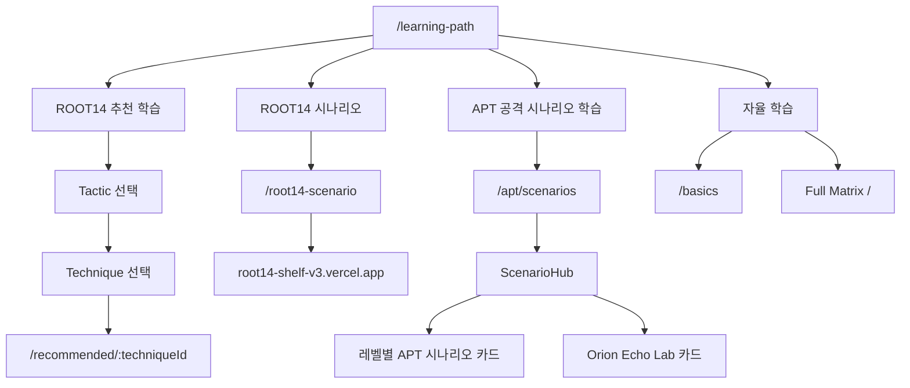
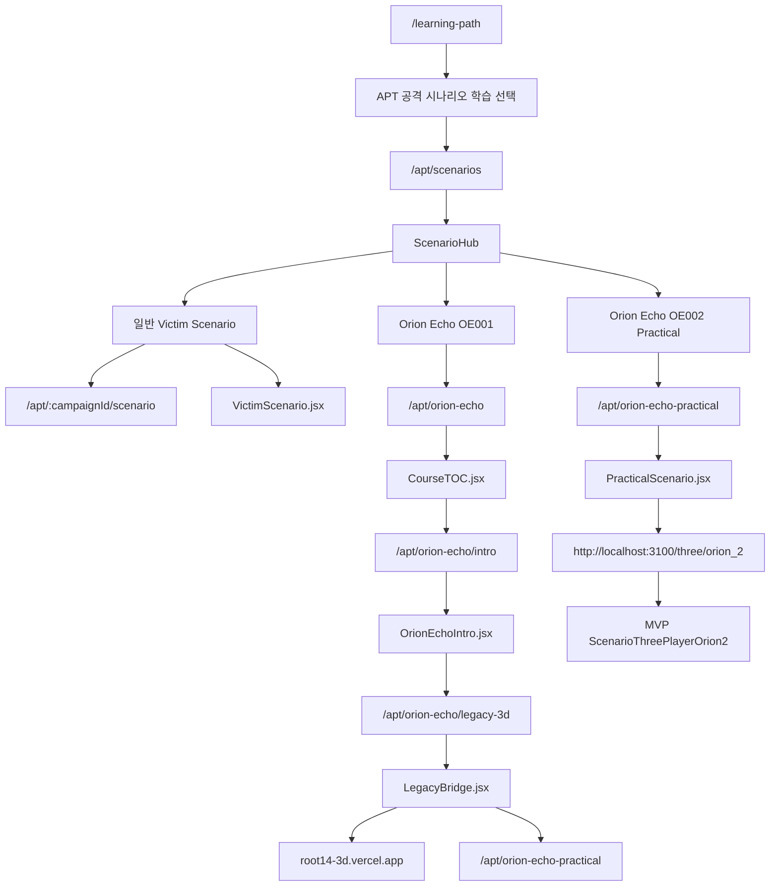
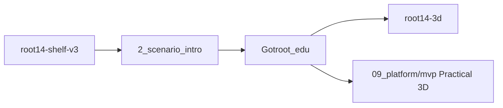

# 01. Current Map

현재 사용자가 말하는 커리큘럼은 `/learning-path`에서 시작되는 APT 공격 시나리오 학습 흐름이다.

## 상위 학습 흐름

`/learning-path`는 단일 커리큘럼 페이지라기보다 학습 방식 선택 허브에 가깝다.

## APT 공격 시나리오 학습 현재 흐름

## 관련 파일

| 영역 | 파일 |
| --- | --- |
| 라우팅 | `src/App.jsx` |
| Learning Path | `src/pages/LearningPathChoice.jsx` |
| APT Hub | `src/pages/apt/study/ScenarioHub.jsx` |
| 일반 1인칭 시나리오 엔진 | `src/pages/apt/study/VictimScenario.jsx` |
| Orion Echo TOC | `src/pages/apt/orion-echo/CourseTOC.jsx` |
| Orion Echo briefing | `src/pages/apt/orion-echo/OrionEchoIntro.jsx` |
| Legacy 3D handoff | `src/pages/apt/orion-echo/LegacyBridge.jsx` |
| Practical briefing | `src/pages/apt/orion-echo/PracticalScenario.jsx` |
| Practical data | `src/pages/apt/orion-echo/data/orion-echo-practical.json` |
| Practical 3D MVP | `senario/09_platform/mvp/app/three/orion_2/page.tsx` |
| Practical 3D player | `senario/09_platform/mvp/components/ScenarioThreePlayerOrion2.tsx` |

## 외부/다중 레포 체인

동료가 전달한 프롬프트 기준으로 보면 전체 체인은 다음처럼 나뉜다.

| 레포/영역 | 역할 |
| --- | --- |
| `root14-shelf-v3` | 사용자가 시나리오를 고르는 선반. `caseId`를 다음 단계로 넘긴다. |
| `2_scenario_intro` | 작전 브리핑/인트로. `ScenarioIntro.jsx` 중심. |
| `Gotroot_edu` | 현재 메인 교육 앱. learning-path, APT Hub, TOC, practical briefing을 담당. |
| `root14-3d` | 기존 Legacy 3D 세션. |
| `senario/09_platform/mvp` | 현재 최종 Practical 3D MVP. |

