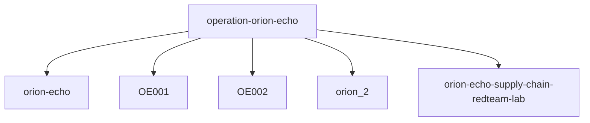

# 02. Problems

현재 구조는 동작하는 부분이 있지만, 개발과 확장 관점에서는 여러 문제가 있다.

## 1. 단일 기준 데이터가 없다

새 APT 시나리오를 추가할 때 기준이 되는 단일 manifest가 없다.

현재는 정보가 여러 위치에 흩어져 있다.

- `ScenarioHub.jsx` 안의 `LABS`
- `CourseTOC.jsx` 안의 `SECTIONS`
- `OrionEchoIntro.jsx` 안의 briefing 구성
- `PracticalScenario.jsx` 안의 route와 UI
- `orion-echo-practical.json` 안의 practical 데이터
- `ScenarioThreePlayerOrion2.tsx` 안의 3D topology/stage 상수

결과적으로 새 시나리오가 오면 데이터만 추가하는 것이 아니라 컴포넌트와 라우트까지 직접 추가해야 한다.

## 2. Orion Echo 전용 구현이 많다

Orion Echo는 현재 다음 파일들에 강하게 묶여 있다.

- `src/pages/apt/orion-echo/CourseTOC.jsx`
- `src/pages/apt/orion-echo/OrionEchoIntro.jsx`
- `src/pages/apt/orion-echo/LegacyBridge.jsx`
- `src/pages/apt/orion-echo/PracticalScenario.jsx`
- `senario/09_platform/mvp/components/ScenarioThreePlayerOrion2.tsx`

이 구조는 MVP를 빨리 만들기에는 좋지만, 다른 시나리오를 같은 형식으로 찍어내기에는 좋지 않다.

## 3. caseId가 전체 체인의 primary key로 정리되어 있지 않다

동료가 전달한 프롬프트에서는 다음 `caseId`를 절대 바꾸지 말라고 되어 있다.

- `operation-orion-echo`
- `operation-ledger-mirage`

하지만 현재 메인 앱에는 `OE001`, `OE002`, `orion-echo`, `orion_2`, `C0024` 같은 여러 ID 체계가 공존한다.



이 매핑이 명시적으로 관리되지 않으면 레포 사이 연결이 쉽게 깨진다.

## 4. route가 템플릿화되어 있지 않다

현재 Orion Echo route는 대부분 전용 route다.

- `/apt/orion-echo`
- `/apt/orion-echo/intro`
- `/apt/orion-echo/legacy-3d`
- `/apt/orion-echo-practical`
- `http://localhost:3100/three/orion_2`

목표 구조에서는 다음처럼 일반화할 수 있어야 한다.

```text
/apt/:caseSlug
/apt/:caseSlug/intro
/apt/:caseSlug/legacy-3d
/apt/:caseSlug/practical
/three/:caseSlug
```

단, 이미 외부 레포와 배포가 연결된 route는 바로 바꾸면 안 된다. 먼저 호환 레이어를 둬야 한다.

## 5. 같은 역할의 화면이 여러 스타일로 구현되어 있다

APT Hub, Course TOC, Intro, Practical, MVP 3D가 각각 별도 스타일과 데이터 접근 방식을 가진다.

특히 `ScenarioIntro` 레포에는 군사 작전 브리핑/classified HUD 톤 규칙이 명시되어 있는데, 메인 앱과 MVP 쪽에는 이 규칙이 일관되게 강제되어 있지 않다.

## 6. 협업 안전장치가 레포별로만 존재한다

동료가 준 `CLAUDE.md` 가드레일은 `2_scenario_intro`에 매우 구체적이다.

하지만 전체 APT 체인에는 아직 공통 가드레일이 없다.

필요한 공통 가드레일:

- 수정 가능 파일 whitelist
- route 변경 금지
- caseId 변경 금지
- `.env` git 금지
- build 통과 전 PR 금지
- Vercel 배포는 사용자만
- 외부 레포 도메인 임의 추측 금지

## 7. MVP와 production 흐름의 경계가 흐리다

`senario/09_platform/mvp`는 현재 최종 Practical 3D 기준이지만, 메인 앱과 별도 Next 앱으로 존재한다.

이 자체는 나쁘지 않지만 다음이 명확해야 한다.

- 이 MVP가 장기적으로 독립 서비스인지
- 메인 앱으로 흡수될 예정인지
- Vercel 배포 URL은 무엇인지
- `localhost:3100` 링크를 production에서 어떻게 대체할지

현재는 이 경계가 문서화되어 있지 않다.

