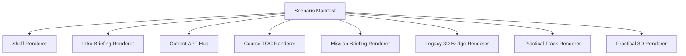
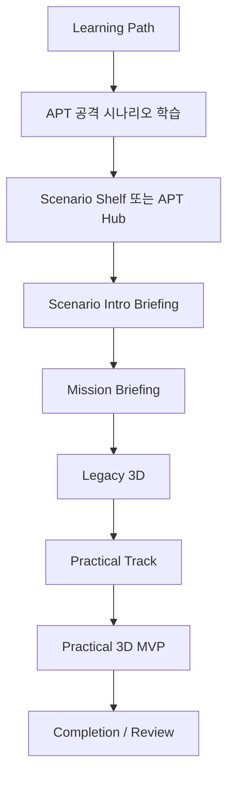
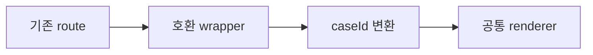

# 03. Target Architecture

목표는 APT 공격 시나리오 학습을 `caseId` 기반 템플릿 시스템으로 만드는 것이다.

새 시나리오가 들어왔을 때 route와 컴포넌트를 매번 새로 만들지 않고, 정해진 manifest에 데이터를 채우면 같은 형식의 커리큘럼이 생성되어야 한다.

## 핵심 원칙

1. `caseId`를 전체 체인의 primary key로 사용한다.
2. 시나리오별 데이터는 manifest로 분리한다.
3. 화면은 공통 renderer가 담당한다.
4. 레포별 책임을 명확히 분리한다.
5. 기존 route는 바로 깨지지 않도록 호환 route를 둔다.
6. MVP 화면을 기준으로 템플릿화하되, 이전 generic player와 섞지 않는다.

## 목표 흐름



사용자 경험 흐름은 다음과 같다.



## 권장 디렉토리 구조

메인 교육 앱 기준:

```text
src/
  data/
    apt-scenarios/
      manifests/
        operation-orion-echo.js
        operation-ledger-mirage.js
      index.js
  pages/
    apt/
      scenario-template/
        AptScenarioHub.jsx
        AptCourseTOC.jsx
        AptMissionBriefing.jsx
        AptLegacyBridge.jsx
        AptPracticalTrack.jsx
  lib/
    apt/
      caseIdMap.js
      validateScenarioManifest.js
```

Practical 3D MVP 기준:

```text
senario/09_platform/mvp/
  data/
    scenarios/
      operation-orion-echo.three.js
  components/
    ScenarioThreePlayerOrion2.tsx
    ScenarioThreeTemplatePlayer.tsx
  lib/
    scenario/
      threeTemplateSchema.ts
```

초기에는 기존 `ScenarioThreePlayerOrion2.tsx`를 바로 없애지 않는다. 먼저 데이터만 분리하고, 같은 화면이 유지되는지 검증한다.

## 호환 route 전략

기존 route는 외부 레포와 연결되어 있을 수 있으므로 바로 바꾸지 않는다.



예:

| 기존 route | 내부 변환 |
| --- | --- |
| `/apt/orion-echo` | `caseId=operation-orion-echo`, view=`toc` |
| `/apt/orion-echo/intro` | `caseId=operation-orion-echo`, view=`briefing` |
| `/apt/orion-echo/legacy-3d` | `caseId=operation-orion-echo`, view=`legacyBridge` |
| `/apt/orion-echo-practical` | `caseId=operation-orion-echo`, view=`practical` |
| `/three/orion_2` | `caseId=operation-orion-echo`, view=`practical3d` |

이렇게 하면 기존 링크를 유지하면서 내부 구현만 템플릿화할 수 있다.

## 개발 원칙

- 먼저 Orion Echo를 기준 시나리오로 삼는다.
- 기능을 새로 만들기보다 기존 화면을 manifest 기반으로 옮긴다.
- 한 번에 route를 갈아엎지 않는다.
- 데이터 분리 후 build와 브라우저 화면을 반드시 비교한다.
- 외부 레포와 연결된 URL은 문서화 전까지 추측해서 바꾸지 않는다.

