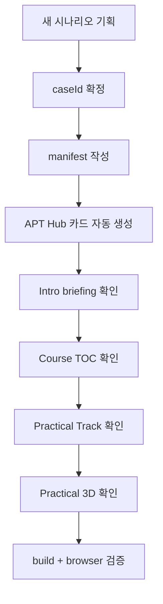

# 04. Scenario Template

이 문서는 APT 공격 시나리오 학습을 템플릿화하기 위한 manifest 초안이다.

목표는 새 시나리오가 들어왔을 때 이 구조를 채우면 다음 화면이 같은 형식으로 생성되는 것이다.

- Scenario Shelf 카드
- Scenario Intro briefing
- APT Hub 카드
- Course TOC
- Mission Briefing
- Legacy 3D handoff
- Practical Track
- Practical 3D

## Manifest 초안

```ts
export type AptScenarioManifest = {
  caseId: string
  aliases: {
    shelfCaseId?: string
    eduSlug: string
    labIds?: string[]
    mvpSlug?: string
  }
  title: string
  shortTitle: string
  group: string
  summary: string
  difficulty: 'beginner' | 'intermediate' | 'advanced' | 'expert'
  level: 1 | 2 | 3 | 4 | 5
  estimatedMinutes: number
  status: 'draft' | 'available' | 'preparing' | 'closed'
  theme: {
    accent: string
    secondary?: string
    tone: 'classified-briefing' | 'intel-hud' | 'practical-range'
  }
  routes: {
    shelf?: string
    intro?: string
    toc?: string
    missionBriefing?: string
    legacy3d?: string
    practical?: string
    practical3d?: string
    completion?: string
  }
  intro: ScenarioIntroSpec
  curriculum: CurriculumSpec
  conceptClass: ConceptClassSpec
  practical: PracticalScenarioSpec
  three?: PracticalThreeSpec
  safety: SafetySpec
}
```

## ID 규칙

`caseId`는 전체 체인의 기준 ID다.

예:

```ts
caseId: 'operation-orion-echo'
```

현재 혼재된 ID는 `aliases`에 모은다.

```ts
aliases: {
  shelfCaseId: 'operation-orion-echo',
  eduSlug: 'orion-echo',
  labIds: ['OE001', 'OE002'],
  mvpSlug: 'orion_2'
}
```

## Intro spec

`2_scenario_intro` 레포가 사용할 수 있는 데이터다.

```ts
export type ScenarioIntroSpec = {
  dossierPanels: Array<{
    id: string
    title: string
    value: string
    description?: string
    mitre?: string[]
  }>
  missionFlow: Array<{
    id: string
    order: number
    title: string
    description: string
    perspective: 'attacker' | 'defender' | 'blue' | 'neutral'
  }>
  defaults: {
    nextRoute: string
    cinematicRoute?: string
  }
}
```

## Curriculum spec

메인 교육 앱의 TOC와 briefing이 사용할 데이터다.

```ts
export type CurriculumSpec = {
  tocSections: Array<{
    id: number
    label: string
    summary: string
    routeKey: 'missionBriefing' | 'legacy3d' | 'practical' | 'practical3d' | 'completion'
    open: boolean
    note?: string
  }>
  briefing: {
    eyebrow: string
    title: string
    subtitle: string
    story: string[]
    persona: {
      role: string
      setup: string
    }
    stages: Array<{
      id: number
      name: string
      objective: string
      mitre?: string[]
    }>
    cta: {
      label: string
      routeKey: string
    }
  }
}
```

## Practical spec

## Concept Class spec

Concept Class는 텍스트 강의가 아니라 2D Network Boundary Map을 중심으로 구성한다.

```ts
export type ConceptClassSpec = {
  introMap: {
    title: string
    thesis: string
    zones: Array<{
      id: string
      label: string
      description: string
      boundaryType: 'external' | 'dmz' | 'internal' | 'devops' | 'release' | 'customer'
    }>
    nodes: Array<{
      id: string
      label: string
      zoneId: string
      role: string
    }>
    boundaries: Array<{
      id: string
      sourceZoneId: string
      targetZoneId: string
      label: string
      concepts: string[]
    }>
    conceptMarkers: Array<{
      id: string
      label: string
      targetType: 'zone' | 'node' | 'boundary' | 'path'
      targetIds: string[]
    }>
  }
  lessons: Array<{
    id: string
    title: string
    analogy: string
    plainDefinition: string
    highlightedZoneIds: string[]
    highlightedNodeIds: string[]
    highlightedBoundaryIds: string[]
    attackUse: string
    defenseEvidence: string[]
    checkpoint: {
      question: string
      answer: string
    }
    practitionerNote?: string
  }>
}
```

각 lesson은 다음 흐름을 따른다.

```text
쉬운 비유 -> 한 문장 정의 -> 2D 도식 강조 -> 공격 악용 -> 방어 증거 -> 체크 질문
```

필수 개념 후보:

- Supply Chain Attack
- Trust Relationship
- Token / SSO
- CI/CD Pipeline
- Signing
- Update Channel
- Evidence & Detection

## Practical spec

`PracticalScenario.jsx` 같은 practical track이 사용할 데이터다.

```ts
export type PracticalScenarioSpec = {
  title: string
  summary: string
  learningObjectives: string[]
  safetyLevel: string
  zones: PracticalZone[]
  nodes: PracticalNode[]
  edges: PracticalEdge[]
  steps: PracticalStep[]
}
```

## Practical 3D spec

현재 MVP의 `ScenarioThreePlayerOrion2.tsx` 내부 상수들을 나중에 이 구조로 옮긴다.

```ts
export type PracticalThreeSpec = {
  title: string
  subtitle?: string
  topology: {
    zones: ThreeZone[]
    nodes: ThreeNode[]
    paths: ThreePath[]
  }
  stages: Array<{
    id: number
    title: string
    tactic: string
    summary: string
    activeNodeIds: string[]
    activePathIds: string[]
    cameraFocus?: string
  }>
  narratives: Array<{
    stageId: number
    heading: string
    evidenceNote: string
    body: string
    defensiveTakeaway?: string
  }>
}
```

## Safety spec

APT 시나리오는 교육용이어야 하므로 안전 범위를 manifest에 포함한다.

```ts
export type SafetySpec = {
  labOnly: boolean
  allowedActions: string[]
  disallowedActions: string[]
  notes: string[]
}
```

예:

```ts
safety: {
  labOnly: true,
  allowedActions: [
    'authorized red-team simulation',
    'lab-contained topology visualization',
    'defensive evidence review'
  ],
  disallowedActions: [
    'real malware generation',
    'external C2 infrastructure',
    'credential theft against real services',
    'destructive payloads'
  ],
  notes: [
    'All infrastructure and credentials must be fictional or lab-scoped.'
  ]
}
```

## 새 시나리오 추가 절차


