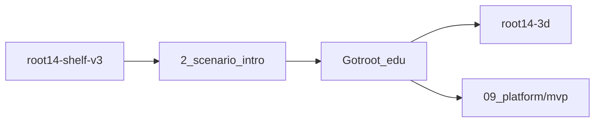

# 05. Repo Responsibilities

APT 커리큘럼은 여러 레포/서비스가 이어진 체인이다. 각 레포의 책임을 분리하지 않으면 한 화면 수정이 다른 배포를 깨뜨릴 수 있다.

## 전체 체인

## 레포별 책임

| 레포/영역 | 책임 | 수정 주의 |
| --- | --- | --- |
| `root14-shelf-v3` | 시나리오 선반, case 선택 | caseId를 임의 변경하지 않는다. |
| `2_scenario_intro` | 작전 브리핑/인트로 | 동료 프롬프트의 whitelist를 따른다. |
| `Gotroot_edu` | learning-path, APT Hub, TOC, practical briefing | route와 외부 링크 변경에 주의한다. |
| `root14-3d` | Legacy 3D 세션 | 현재는 내부 구조 수정 대상이 아니다. |
| `senario/09_platform/mvp` | Practical 3D MVP | 최종 `/three/orion_2` 기준 화면을 보존한다. |

## 2_scenario_intro 협업 가드레일 요약

동료가 전달한 프롬프트 기준으로 `2_scenario_intro`에서는 다음이 중요하다.

허용 파일:

- `src/ScenarioIntro.jsx`
- `src/components/root14/MITREChip.jsx`
- `src/components/root14/OperationHeader.jsx`
- `src/components/root14/IntelPanel.jsx`
- `src/components/root14/ThreatLevel.jsx`
- `src/components/root14/OperationControl.jsx`
- `src/components/root14/index.js`
- `src/components/root14/README.md`

금지 항목:

- `src/state/campaignStore.js`
- `src/data/gotrootTutorialScenario.js`
- `localStorage` key `root14_campaign_state`
- `caseId` 값
- `CINEMATIC_ROUTE`
- `OPERATION_DEFAULTS`
- `/intro/:caseId` route 형식
- `vite.config.js`
- `package.json`
- `vercel.json`

이 규칙은 해당 레포뿐 아니라 전체 체인의 설계 원칙으로도 봐야 한다.

## 공통 협업 규칙 제안

모든 관련 레포에 다음 원칙을 둔다.

1. route 변경은 별도 승인 없이는 금지한다.
2. caseId 변경은 별도 승인 없이는 금지한다.
3. `.env`는 git에 올리지 않는다.
4. build 통과 전 PR을 올리지 않는다.
5. Vercel 배포 권한은 사용자만 가진다.
6. 외부 레포의 도메인과 route를 추측해서 바꾸지 않는다.
7. 새 시나리오는 manifest 먼저 작성하고 화면을 붙인다.

## Gotroot_edu 내부 경계

현재 메인 앱에서는 다음 경계를 지키는 것이 좋다.

| 영역 | 수정 방향 |
| --- | --- |
| `src/pages/LearningPathChoice.jsx` | 학습 방식 선택 허브. 큰 구조 변경은 신중히. |
| `src/pages/apt/study/ScenarioHub.jsx` | APT Hub. 나중에 manifest 기반 카드 렌더러로 변경. |
| `src/pages/apt/orion-echo/*` | Orion Echo 전용 구현. 공통 template으로 추출할 후보. |
| `src/App.jsx` | route table. 호환 route를 유지하면서 새 generic route 추가. |
| `senario/09_platform/mvp/*` | Practical 3D MVP. 기존 최종 화면 보존 우선. |

