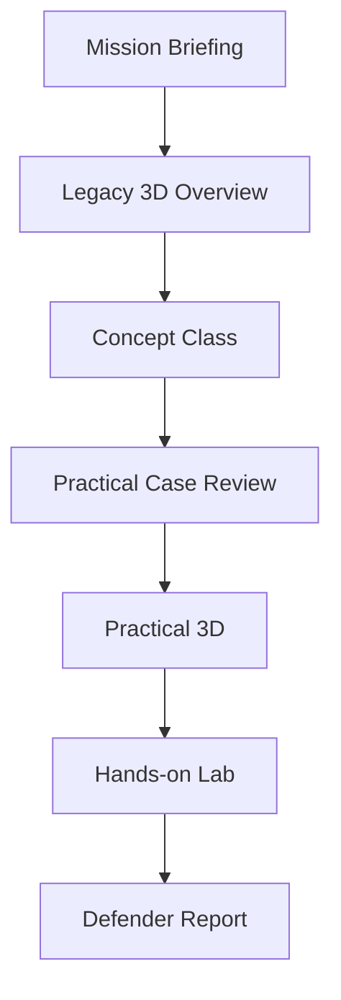
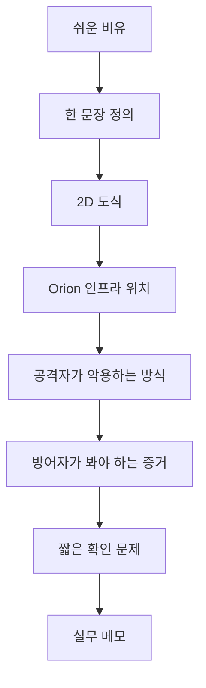
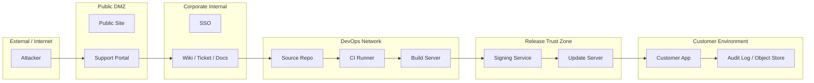
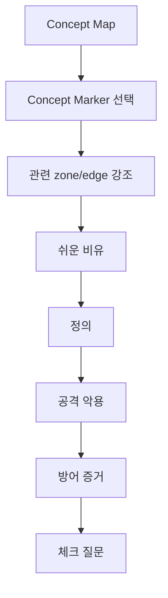

# 07. Concept Class Design

이 문서는 APT 공격 시나리오 학습에서 `Concept Class`를 어떻게 구성할지 정리한다.

핵심 결론:

> Concept Class는 텍스트 강의가 아니라, 2D Network Boundary Map을 기준으로 개념을 인프라에 꽂아 설명하는 교육 구간이어야 한다.

## 왜 Concept Class가 필요한가

현재 Legacy 3D는 공격 흐름을 감각적으로 보여주는 데는 좋지만, 대학생이 보안 개념을 깊게 이해하기에는 부족하다.

Legacy 3D에서 학습자가 얻는 것:

- 공격 흐름의 분위기
- MITRE tactic의 순서
- 외부에서 내부, 개발망, 고객망으로 이어지는 큰 이동 감각
- 단계별 shell 예시

Legacy 3D에서 부족한 것:

- 각 네트워크 망의 경계
- 공급망 공격의 핵심 개념
- 신뢰 관계가 왜 위험해지는지
- SSO/token/CI/CD/signing/update channel의 역할
- 방어자가 봐야 하는 로그와 증거
- 실제 사건을 분석하는 사고 순서

따라서 Legacy 3D 다음에 Concept Class를 두어야 한다.

## 추천 전체 흐름



역할 분리:

| 단계 | 역할 |
| --- | --- |
| Legacy 3D | 사건 흐름을 감각적으로 보는 오프닝 시각화 |
| Concept Class | 핵심 개념을 대학생도 이해할 수 있게 설명 |
| Practical Case Review | 배운 개념을 사건, 인프라, 증거, 탐지 관점으로 재정리 |
| Practical 3D | topology 위에서 단계별 연결을 확인 |
| Hands-on Lab | 로그/증거/판단 문제를 직접 수행 |
| Defender Report | 방어자 관점 최종 정리 |

## Concept Class의 핵심 원칙

개념을 먼저 교과서처럼 설명한 뒤 인프라에 붙이는 방식은 좋지 않다.

대신 다음 순서가 좋다.



각 개념은 항상 같은 형식으로 설명한다.

| 블록 | 설명 |
| --- | --- |
| 쉬운 비유 | 대학생이 바로 이해할 수 있는 현실 비유 |
| 한 문장 정의 | 어려운 용어를 짧게 정의 |
| 2D 도식 | 개념이 걸리는 구간을 시각화 |
| Orion 인프라 위치 | 실제 시나리오 topology에서 어디인지 표시 |
| 공격자 관점 | 공격자가 그 개념을 어떻게 악용하는지 |
| 방어자 관점 | 어떤 로그/증거/탐지 포인트를 봐야 하는지 |
| 체크 질문 | 이해 여부를 확인하는 짧은 질문 |
| 실무 메모 | 실제 현업에서 놓치기 쉬운 포인트 |

## Concept Class 첫 화면

Concept Class의 첫 화면은 텍스트 목차가 아니라 `2D Network Boundary Map`이어야 한다.

목적:

- 학습자에게 사건의 세계지도를 먼저 보여준다.
- 각 개념이 어디에 붙는지 시각적으로 알려준다.
- 이후 모든 개념 설명이 이 지도 위에서 이어지게 한다.

첫 화면에서 보여줄 메시지:

```text
이 사건은 고객사를 직접 공격한 사건이 아니다.
고객이 신뢰하던 업데이트 경로가 오염된 사건이다.
```

## 2D가 적합한 이유

| 방식 | 장점 | 단점 | 결론 |
| --- | --- | --- | --- |
| 텍스트 | 구현이 빠름 | 구조가 머릿속에 남지 않음 | 보조 설명으로만 사용 |
| 3D | 몰입감이 좋음 | 개념 설명에는 과하고 초보자가 헷갈릴 수 있음 | Legacy/Practical 3D에서 사용 |
| 2D 도식 | 경계, 개념, 신뢰 관계를 명확히 보여줌 | 연출은 3D보다 약함 | Concept Class에 가장 적합 |

Concept Class에서는 2D 도형 기반 도식을 사용한다.

3D는 다음 역할로 분리한다.

```text
Legacy 3D      = 사건 흐름과 몰입
Concept 2D Map = 개념 정리와 망 경계 이해
Practical 3D   = 상세 topology walkthrough
```

## 2D Network Boundary Map

Concept Class 첫 화면의 핵심 도식은 다음과 같은 망 경계 지도다.



이 도식은 Practical 3D의 상세 topology가 아니라, 개념 교육용으로 단순화한 지도다.

## 반드시 표현해야 할 망 경계

| 경계 | 의미 | 관련 개념 |
| --- | --- | --- |
| External -> DMZ | 외부에서 노출 서비스 접근 | attack surface, public-facing app, initial access |
| DMZ -> Corporate Internal | foothold 이후 내부 업무망 접근 | discovery, internal service, lateral movement |
| Corporate Internal -> DevOps | 업무 계정/토큰을 통한 개발망 접근 | SSO, token, service account |
| DevOps -> Release Trust Zone | 빌드 결과물이 릴리즈 체인으로 넘어감 | CI/CD, build artifact, signing |
| Release Trust Zone -> Customer | 고객이 신뢰하는 업데이트 경로 | trust relationship, update channel, supply chain |

학습자는 이 경계를 통해 다음 질문에 답할 수 있어야 한다.

- 어디까지가 외부인가?
- 어디부터 내부인가?
- 어디가 개발망인가?
- 어디가 배포 신뢰 구간인가?
- 어디가 고객망인가?
- 공격자는 어느 경계를 넘었는가?
- 어느 경계는 직접 넘지 않고 신뢰 관계로 우회했는가?

## 색상/시각 규칙

Concept Map에서는 경로의 의미를 색으로 구분한다.

| 시각 요소 | 의미 |
| --- | --- |
| 빨간 선 | 공격자가 실제로 이동한 경로 |
| 파란 선 | 정상 신뢰/업데이트 경로 |
| 노란 선 | 공격자가 악용한 신뢰 경계 |
| 초록 점 | 방어자가 확인할 수 있는 증거 지점 |
| 흐린 영역 | 현재 개념과 직접 관련 없는 영역 |
| 밝은 영역 | 현재 설명 중인 개념의 인프라 구간 |

ROOT14 톤:

- 배경은 어두운 classified HUD 스타일
- zone은 얇은 선으로 나눈 사각 컨테이너
- border radius는 최소화
- 연결선은 glow를 사용하되 과하지 않게
- 글자는 명확하고 크게
- 개념 marker는 작은 badge로 표시

## 개념 marker

첫 화면에는 다음 개념 marker를 지도 위에 배치한다.

| Concept | 지도 위치 |
| --- | --- |
| Supply Chain Attack | DevOps -> Release -> Customer 전체 경로 |
| Trust Relationship | Release Trust Zone -> Customer Environment |
| Token / SSO | Corporate Internal -> DevOps |
| CI/CD Pipeline | DevOps Network 내부 |
| Signing | Release Trust Zone 내부 |
| Update Channel | Update Server -> Customer App |
| Evidence & Detection | Build Log, Signing Log, Manifest, Audit Log 주변 |

개념 marker를 클릭하면 해당 구역만 강조하고 설명 패널을 연다.



## 예시: Trust Relationship

```text
비유:
학교 포털에 올라온 파일은 안전하다고 믿고 다운로드하는 것.

한 문장 정의:
한 시스템이 다른 시스템의 결과, 신원, 서명, 배포물을 신뢰하는 관계.

Orion 인프라 위치:
Signing Service -> Update Server -> Customer App

공격자 관점:
고객사를 직접 공격하지 않고, 고객이 신뢰하는 업데이트 경로를 오염시킨다.

방어자 관점:
외부 침입 로그만 보면 안 된다. signing log, release manifest, artifact hash,
update channel audit, customer update history를 함께 봐야 한다.

체크 질문:
고객망에 직접 침입하지 않았는데도 고객이 영향을 받는 이유는 무엇인가?
```

## 예시: CI/CD Pipeline

```text
비유:
햄버거 공장처럼, 재료가 들어오고 조립되고 포장되고 매장으로 배송되는 라인.

한 문장 정의:
개발자가 만든 코드를 자동으로 빌드, 테스트, 서명, 배포까지 보내는 공정.

Orion 인프라 위치:
Source Repo -> CI Runner -> Build Server -> Signing Service -> Update Server

공격자 관점:
공장 라인 중간에 손을 대면 정상 포장과 정상 배송 경로를 통해 오염된 결과물이 고객에게 전달된다.

방어자 관점:
commit diff, CI job history, build log, artifact hash, signing event를 확인해야 한다.
```

## Concept Class 템플릿 데이터

나중에 manifest에는 다음 구조가 들어가야 한다.

```ts
type ConceptClass = {
  introMap: {
    title: string
    thesis: string
    zones: ConceptZone[]
    nodes: ConceptNode[]
    boundaries: ConceptBoundary[]
    conceptMarkers: ConceptMarker[]
  }
  lessons: ConceptLesson[]
}

type ConceptLesson = {
  id: string
  title: string
  analogy: string
  plainDefinition: string
  highlightedZoneIds: string[]
  highlightedNodeIds: string[]
  highlightedBoundaryIds: string[]
  attackUse: string
  defenseEvidence: string[]
  checkpoint: {
    question: string
    answer: string
  }
  practitionerNote?: string
}
```

## 학습 성공 기준

Concept Class를 완료한 학습자는 다음을 말로 설명할 수 있어야 한다.

1. 공급망 공격이 직접 침입과 어떻게 다른지
2. Orion Echo에서 고객이 신뢰한 경로가 무엇인지
3. SSO/token이 DevOps 접근에 왜 중요한지
4. CI/CD pipeline이 왜 공격 표면이 되는지
5. signing/update channel이 왜 공급망 공격의 핵심인지
6. 방어자가 어떤 로그와 증거를 확인해야 하는지

