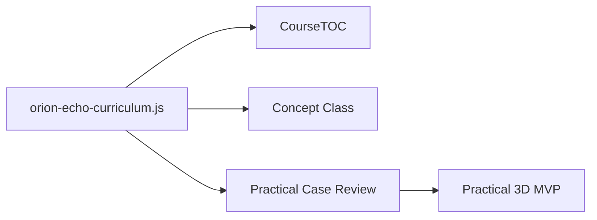

# Curriculum Manifest Implementation

## 목적

Orion Echo 커리큘럼은 이제 화면별 하드코딩을 줄이고, 하나의 curriculum manifest를 기준으로 구성한다.

현재 manifest:

`src/pages/apt/orion-echo/data/orion-echo-curriculum.js`

이 파일은 다음 화면에서 공유된다.

- `CourseTOC.jsx`
- `ConceptClass.jsx`
- `PracticalScenario.jsx`

## 현재 연결 방식

## Manifest 필드

### scenario

시나리오의 기본 메타데이터다.

- `id`
- `slug`
- `title`
- `subtitle`
- `audience`
- `difficulty`
- `estimatedMinutes`

### routes

현재 레포 안에서 사용하는 라우트 묶음이다.

- `toc`
- `intro`
- `legacy3d`
- `concepts`
- `practical`

주의: 라우트는 다른 레포와 연결될 수 있으므로 임의 변경하지 않는다.

### sessions

learning-path에서 보여줄 전체 교육 흐름이다.

권장 순서:

1. Mission Briefing
2. Legacy 3D Overview
3. Concept Class
4. Practical Case Review
5. Practical 3D
6. Hands-on Lab
7. Defender Report

`planned: true`를 넣으면 아직 준비중인 단계로 표시한다.

### conceptClass

개념 교육 페이지를 구성하는 데이터다.

포함 항목:

- `headline`
- `summary`
- `mapTitle`
- `infrastructure.zones`
- `infrastructure.boundaries`
- `concepts`

각 concept는 다음 필드를 가진다.

- `id`
- `title`
- `short`
- `analogy`
- `definition`
- `focusZones`
- `focusBoundaries`
- `attackUse`
- `defenseEvidence`
- `checkpoint`

## 새 시나리오를 만들 때

1. 기존 manifest를 복제한다.
2. `scenario`, `sessions`, `conceptClass`를 먼저 채운다.
3. Practical topology JSON의 zone/node/edge ID와 `focusZones`, `focusBoundaries` 명칭을 맞춘다.
4. Concept Class 화면에서 망 경계가 의도대로 강조되는지 확인한다.
5. Practical Case Review에서 같은 시나리오 제목, 설명, 3D URL을 읽는지 확인한다.
6. `npm run build`로 검증한다.

## 아직 남은 구조 개선

- Practical timeline의 `steps`도 manifest와 같은 schema로 통합
- JSON schema 또는 Zod validator 추가
- Hands-on Lab / Defender Report용 템플릿 추가
- 여러 시나리오를 `scenarioId` 기반으로 선택하는 loader 추가
