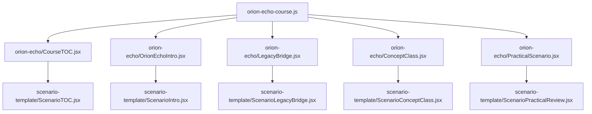

# Scenario Template Extraction

## 현재 상태

Orion Echo 전용 화면 3개를 공통 템플릿으로 승격했다.

공통 템플릿:

```text
src/pages/apt/scenario-template/
  ScenarioIntro.jsx
  ScenarioLegacyBridge.jsx
  ScenarioTOC.jsx
  ScenarioConceptClass.jsx
  ScenarioPracticalReview.jsx
  validateScenarioPackage.js
```

Orion Echo 화면:

```text
src/pages/apt/orion-echo/
  CourseTOC.jsx
  OrionEchoIntro.jsx
  LegacyBridge.jsx
  ConceptClass.jsx
  PracticalScenario.jsx
```

이제 Orion Echo 화면은 직접 UI를 구현하지 않고, `orionEchoCourse`를 공통 템플릿에 전달하는 wrapper 역할만 한다.

## 구조



## 새 시나리오 추가 방식

새 시나리오는 UI를 복사하지 않고 course data만 만든다.

예시:

```text
src/pages/apt/ledger-mirage/
  CourseTOC.jsx
  LedgerMirageIntro.jsx
  LegacyBridge.jsx
  ConceptClass.jsx
  PracticalScenario.jsx
  data/
    ledger-mirage-course.js
    ledger-mirage-curriculum.js
    ledger-mirage-practical.json
```

wrapper 예시:

```jsx
import ScenarioTOC from '../scenario-template/ScenarioTOC';
import { ledgerMirageCourse } from './data/ledger-mirage-course';

export default function CourseTOC() {
  return <ScenarioTOC course={ledgerMirageCourse} />;
}
```

## 템플릿이 기대하는 course shape

```js
{
  curriculum: {
    scenario: {
      id,
      title,
      subtitle,
      audience,
      difficulty,
      estimatedMinutes
    },
    briefing: {
      kicker,
      backLabel,
      headline,
      setup,
      persona,
      story,
      stagesTitle,
      ctaLabel,
      ctaHint
    },
    legacy3d: {
      url,
      backLabel,
      kicker,
      headline,
      summary,
      primaryLabel,
      nextLabel,
      steps
    },
    routes: {
      toc,
      intro,
      legacy3d,
      concepts,
      practical
    },
    sessions: [],
    conceptClass: {
      headline,
      summary,
      mapTitle,
      infrastructure: {
        zones: [],
        boundaries: []
      },
      concepts: []
    },
    practical: {
      threeUrl,
      entryLabel,
      bridgeSummary
    }
  },
  practicalScenario: {
    title,
    summary,
    difficulty,
    estimatedMinutes,
    safetyLevel,
    learningObjectives,
    zones,
    nodes,
    edges,
    steps
  },
  validation
}
```

## 템플릿화 완료 기준

현재 완료된 항목:

- Mission Briefing 공통화
- Legacy 3D bridge 공통화
- Course TOC 공통화
- Concept Class 공통화
- Practical Case Review 공통화
- course package validator 공통화
- Orion 전용 화면은 wrapper만 남김

남은 개선은 템플릿화의 필수 조건은 아니고 운영 자동화 영역이다.

- route 등록을 시나리오별로 반복하지 않게 loader 또는 route factory 검토
- Practical step schema를 더 엄격하게 문서화
- validator를 빌드 전 스크립트로 실행하도록 분리
