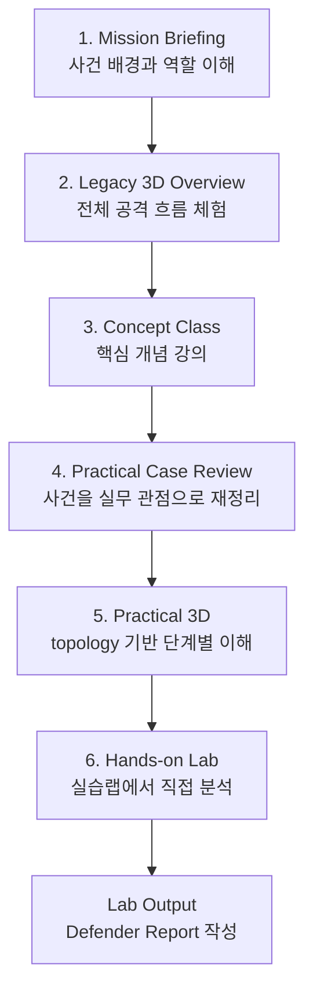
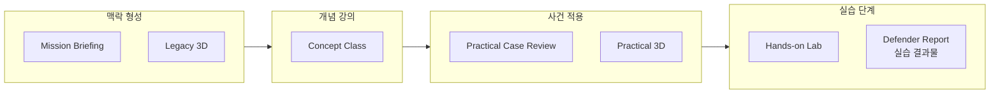

# Curriculum Flow v2

## 핵심 변경

기존 표현 중 `검증/산출` 단계는 `실습 단계`로 변경한다.

이유:

- 교육 플랫폼에서는 개념강의가 끝난 뒤 학습자가 별도 실습랩에 들어가 직접 수행하는 흐름이 자연스럽다.
- 보고서는 독립된 교육 단계라기보다 실습랩의 결과물에 가깝다.
- 따라서 최종 구간은 `Hands-on Lab -> Defender Report`가 아니라, `Hands-on Lab` 안에서 `Defender Report`를 산출하는 구조로 본다.

## 전체 흐름

## 교육 단계 그룹

## 단계별 역할

| 그룹 | 세션 | 역할 |
| --- | --- | --- |
| 맥락 형성 | Mission Briefing | 사건 배경, 학습자 역할, 학습 목표를 잡는다. |
| 맥락 형성 | Legacy 3D | 기존 3D 세션으로 전체 공격 흐름을 먼저 체감한다. |
| 개념 강의 | Concept Class | 공급망, 신뢰 관계, 토큰, CI/CD, 서명, 증거 개념을 인프라 지도 위에서 설명한다. |
| 사건 적용 | Practical Case Review | 배운 개념을 실제 Orion Echo 사건과 관측 지점에 연결한다. |
| 사건 적용 | Practical 3D | 각 단계가 어느 시스템과 망 경계를 통과하는지 topology로 확인한다. |
| 실습 단계 | Hands-on Lab | 실습랩에 들어가 로그, 아티팩트, 토큰 흔적을 직접 분석한다. |
| 실습 단계 | Defender Report | 실습 결과물로 공격 흐름, 증거, 영향 범위, 대응 포인트를 정리한다. |

## 설계 원칙

1. `Concept Class`는 강의다.
2. `Practical Case Review`는 강의와 실습 사이의 해설 구간이다.
3. `Practical 3D`는 실습 전 topology 워크스루다.
4. `Hands-on Lab`부터 학습자가 직접 수행하는 실습 단계다.
5. `Defender Report`는 실습 단계의 최종 산출물이다.

