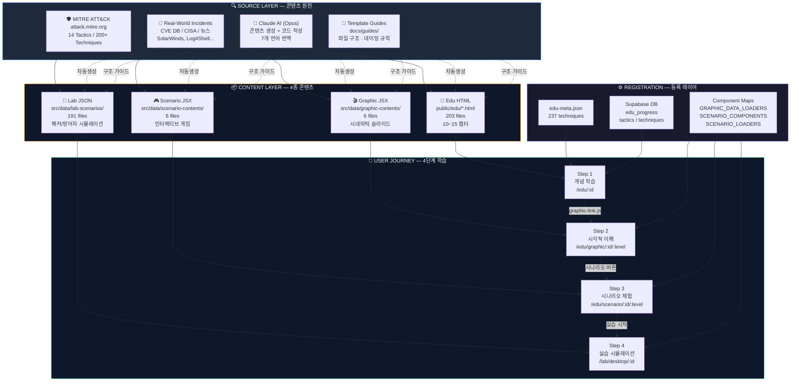
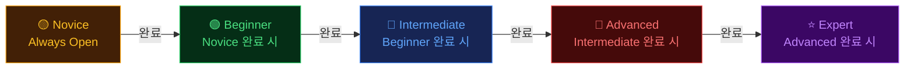
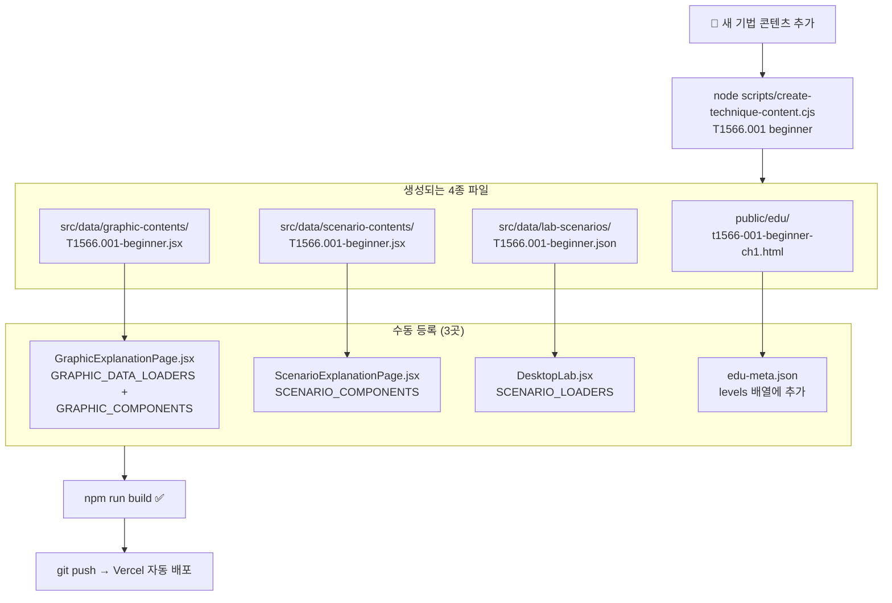
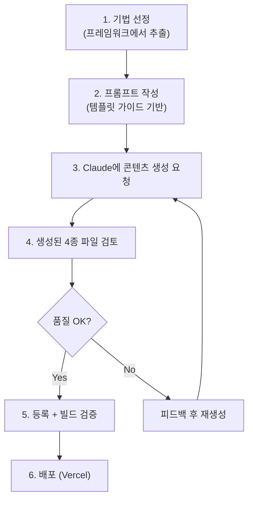

# Gotroot Edu — Content Pipeline

> 콘텐츠 파이프라인 전체 구조 (Mermaid 다이어그램 + 재현 가이드)
> SVG 버전: [content-pipeline-diagram.svg](./content-pipeline-diagram.svg)

---

## 1. 파이프라인 전체 흐름 (Mermaid)



## 2. 레벨 시스템



## 3. 파일 생성 → 등록 흐름



## 4. 콘텐츠 타입별 상세

### 4-1. Edu HTML (`public/edu/`)
| 항목 | 설명 |
|------|------|
| **목적** | 개념 학습 (텍스트 + 코드 예제 + 퀴즈) |
| **파일명** | `t{id}-{level}-ch{n}.html` |
| **출처** | MITRE ATT&CK 공격 기법 설명 + 실제 CVE 분석 |
| **생성** | Claude AI가 MITRE 데이터 기반으로 10~15챕터 자동 생성 |
| **등록** | `edu-meta.json`의 `levels[].url` |
| **스크립트** | `progress-tracker.js` (챕터 완료 → Supabase upsert) |
| **특이사항** | SPA 외부 (React Router 아님), 서버측 JWT 인증 |

### 4-2. Graphic JSX (`src/data/graphic-contents/`)
| 항목 | 설명 |
|------|------|
| **목적** | 시네마틱 시각화 (1280×720 슬라이드쇼) |
| **파일명** | `{TechniqueId}-{level}.jsx` |
| **출처** | 실제 사고 사례를 시각적 스토리텔링으로 재구성 |
| **생성** | Claude AI가 사고 보고서 기반으로 20슬라이드 생성 |
| **export** | `subtitlesData[]` (자막+타이밍) + `renderSlides(lang)` (JSX) |
| **등록** | `GRAPHIC_DATA_LOADERS` + `GRAPHIC_COMPONENTS` 맵 |
| **특이사항** | CinematicPlayer가 자동재생, 전체화면/F키/가로회전 지원 |

### 4-3. Scenario JSX (`src/data/scenario-contents/`)
| 항목 | 설명 |
|------|------|
| **목적** | 인터랙티브 게임 (Sector 탐색, 증거 분석) |
| **파일명** | `{TechniqueId}-{level}.jsx` |
| **출처** | 실제 공격 시나리오를 게임 형태로 재구성 |
| **생성** | Claude AI가 공격 체인 기반으로 3~5 Sector 게임 생성 |
| **export** | `default` (React 컴포넌트, `language` prop 수신) |
| **등록** | `SCENARIO_COMPONENTS` 맵 (React.lazy) |
| **특이사항** | 수료 보고서 모달, 인벤토리 시스템, 점수 채점 |

### 4-4. Lab JSON (`src/data/lab-scenarios/`)
| 항목 | 설명 |
|------|------|
| **목적** | 실습 시뮬레이션 (해커PC + 방어자SOC) |
| **파일명** | `{TechniqueId}-{level}.json` |
| **출처** | MITRE ATT&CK 절차 + 실제 공격 도구 (nmap, mimikatz 등) |
| **생성** | Claude AI가 공격 절차 기반으로 8~15 step 생성 |
| **구조** | `phases[]`, `steps[]`, `desktopIcons[]`, `processTree[]` |
| **등록** | `SCENARIO_LOADERS` 맵 (dynamic import) |
| **특이사항** | TTS 자동재생, feynman/expert 이중 설명, 다국어 지원 |

---

## 5. 다른 사이트에서 동일 퀄리티 재현하기

> **핵심 원칙**: 이 시스템의 퀄리티는 "구조화된 템플릿 + AI 자동생성 + 체계적 등록"에서 나옵니다.

### Step 1: 도메인 지식 체계 정의

```
새 사이트 주제 (예: 네트워크 보안, 클라우드, 포렌식)
  ↓
공인 프레임워크 선정 (MITRE ATT&CK 같은 것)
  ↓
기법/카테고리 목록화 (= Technique ID 역할)
  ↓
레벨 체계 설계 (novice → expert)
```

**이 프로젝트의 경우:**
- 프레임워크: MITRE ATT&CK (attack.mitre.org)
- 카테고리: 14 Tactics → 200+ Techniques → Sub-techniques
- 레벨: 5단계 (novice/beginner/intermediate/advanced/expert)

**다른 사이트 적용 예시:**
| 도메인 | 프레임워크 | 카테고리 |
|--------|-----------|---------|
| 클라우드 보안 | CIS Benchmarks / CSA CCM | 14 Domains → Controls |
| 디지털 포렌식 | NIST SP 800-86 | 4 Phases → Sub-tasks |
| DevSecOps | OWASP SAMM | 5 Functions → 15 Practices |
| AI 보안 | OWASP ML Top 10 | 10 Risks → Attack Vectors |

### Step 2: 4단계 콘텐츠 파이프라인 복제

```
                  새 사이트 구조
                  ═══════════════
   📘 이론 학습     →  HTML 챕터 (개념, 사례, 코드)
   🎬 시각적 이해   →  시네마틱 슬라이드 (JSX/React)
   🎮 시나리오 체험  →  인터랙티브 게임 (JSX/React)
   🧪 실습 시뮬     →  시뮬레이터 (JSON 구조화 데이터)
```

각 단계별 핵심:

| 단계 | 핵심 요소 | 퀄리티 포인트 |
|------|-----------|-------------|
| 이론 | 챕터 분할, 진행률 추적, 잠금 해제 | 10~15챕터로 적절한 분량 유지 |
| 시각화 | 1280×720 고정해상도, 자동재생, 자막 | 실제 사고 기반 스토리텔링 |
| 시나리오 | Sector 기반 탐색, 선택지, 점수 | 몰입감 있는 게임화(Gamification) |
| 실습 | 해커/방어자 이중 뷰, TTS, 단계별 진행 | 실제 명령어 + 파인만 설명 |

### Step 3: Claude AI 활용 콘텐츠 생성 프로세스



**Claude 프롬프트 핵심 요소:**

1. **컨텍스트**: 해당 기법의 MITRE ATT&CK 설명 전문 + 실제 CVE/사고 사례
2. **템플릿**: `docs/guides/` 가이드 문서를 시스템 프롬프트에 포함
3. **제약**: i18n 구조 필수, export 이름/형태 정확히 지정
4. **퀄리티**: "파인만 설명(5살도 이해할 수 있게)" + "전문가 설명" 이중 계층

**프롬프트 예시 (Lab JSON 생성):**
```
MITRE ATT&CK T1566.001 (Spearphishing Attachment) 기반으로
Lab JSON을 생성해줘.

필수 구조: src/data/lab-scenarios/ JSON 스키마 준수
- 8~12 steps, 4 phases (정찰/침투/실행/탐지)
- 각 step: command + output + feynman(쉬운설명) + expert(전문설명)
- 다국어: ko + en 필수, vi/ar/ja/zh/hi는 null
- 실제 도구: nmap, curl, python, mimikatz 등 실제 명령어 사용
- hackerLog: 터미널에 표시될 실제 커맨드 로그
```

### Step 4: 인프라 구성

```
필수 스택:
├── React + Vite (SPA)
├── Supabase (인증 + DB + RLS)
├── Vercel (호스팅 + Edge Middleware)
├── edu-meta.json (콘텐츠 메타데이터)
└── progress-tracker.js (진행률 추적)

선택 스택:
├── TTS (window.speechSynthesis)
├── Fullscreen API (시네마틱)
├── Screen Orientation API (모바일 가로)
└── ContentProtection (워터마크 + 복사방지)
```

### Step 5: 퀄리티 체크리스트

새 콘텐츠 추가 시 반드시 확인:

- [ ] 5개 레벨 중 해당 레벨 콘텐츠가 적절한 난이도인가?
- [ ] feynman 설명이 비전공자도 이해할 수 있는 수준인가?
- [ ] expert 설명이 실무자에게 유용한 수준인가?
- [ ] 실제 명령어/도구가 정확한가? (가짜 명령어 없음)
- [ ] 다국어 구조가 i18n 가이드를 준수하는가?
- [ ] 시네마틱 슬라이드가 20장 내외인가?
- [ ] 시나리오가 3~5 Sector로 적절히 분할되었는가?
- [ ] Lab step이 8~15개로 과하지 않은가?
- [ ] `npm run build` 성공하는가?

---

## 6. 현재 통계 (2026-04)

| 타입 | 파일 수 | 기법 수 | 완성도 |
|------|---------|---------|--------|
| Edu HTML | 203 | ~40 | ███████░░░ 70% |
| Graphic JSX | 6 | 2 | █░░░░░░░░░ 10% |
| Scenario JSX | 6 | 2 | █░░░░░░░░░ 10% |
| Lab JSON | 191 | ~40 | ███████░░░ 70% |
| **등록 (meta)** | — | **237** | ██████████ 100% |

> Graphic/Scenario는 6개씩으로 아직 초기 단계. Edu HTML과 Lab JSON이 주력 콘텐츠.
