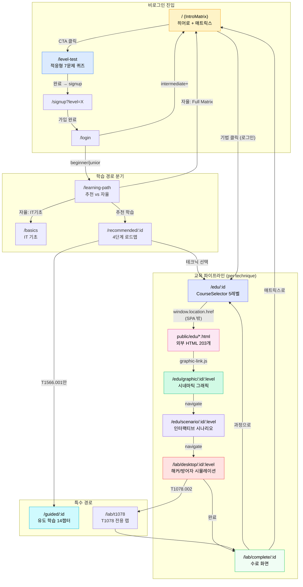
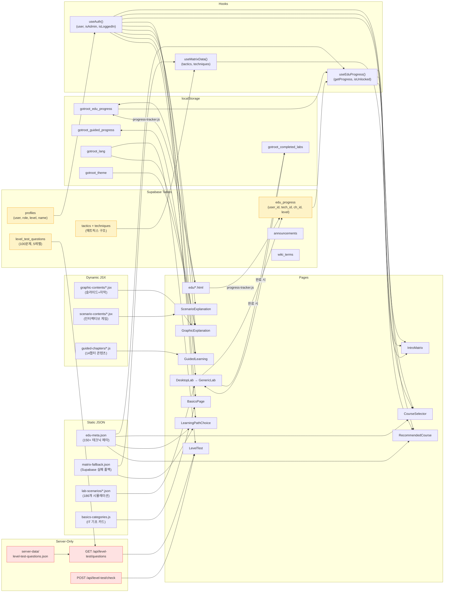
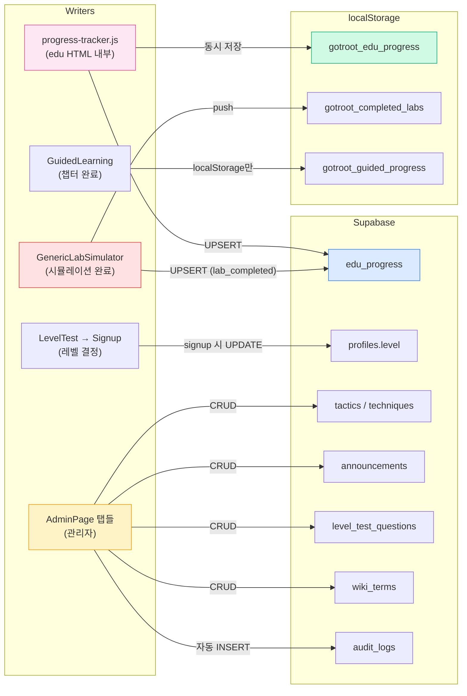
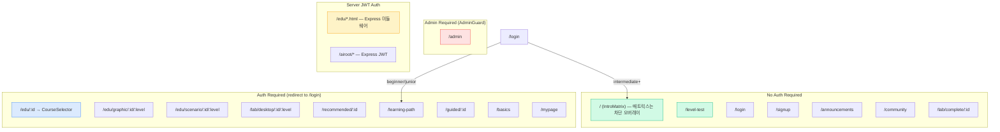

# 15. Dependency Graph (DAG) - 교육 시스템 의존성 그래프

## 1. 페이지 간 네비게이션 DAG (User Flow)



---

## 2. 데이터 의존성 DAG (Data Flow)



---

## 3. 컴포넌트 Import 의존성 트리

```mermaid
graph TD
    subgraph "Context"
        CTX_AUTH["AuthContext.jsx<br/>user, isAdmin, isLoggedIn,<br/>loading, logout"]
    end

    subgraph "Hooks"
        HOOK_EDU["useEduProgress.js"]
        HOOK_MATRIX["useMatrixData.js"]
        HOOK_ZOOM["useSimulationZoom.js"]
        HOOK_ANN["useAnnouncements.js"]
    end

    subgraph "API Layer (Phase 0)"
        API_EDU["api/edu.js<br/>getEduProgress()"]
        API_LT["api/levelTest.js<br/>getQuestions()"]
        API_WIKI["api/wiki.js"]
        API_CLIENT["api/_client.js<br/>supabase client"]
    end

    subgraph "Lib"
        LIB_SUPA["lib/supabase.js<br/>createClient()"]
        LIB_I18N["lib/i18n.js"]
        LIB_SANITIZE["lib/sanitize.js<br/>DOMPurify"]
    end

    subgraph "Shared Components"
        COMP_LANG["LangToggle.jsx<br/>getStoredLang()"]
        COMP_LOADING["LoadingScreen.jsx<br/>VerifyingOverlay"]
        COMP_WIKI["WikiFloatingButton"]
    end

    subgraph "Data"
        DATA_META["edu-meta.json"]
        DATA_FALLBACK["matrix-fallback.json"]
        DATA_LTQ["level-test-questions.js<br/>(메타만)"]
    end

    %% Context → Hooks
    CTX_AUTH --> HOOK_EDU
    LIB_SUPA --> CTX_AUTH

    %% API Layer
    API_CLIENT --> API_EDU
    API_CLIENT --> API_LT
    API_CLIENT --> API_WIKI
    LIB_SUPA --> API_CLIENT

    %% Hooks → API
    HOOK_EDU --> API_EDU
    HOOK_MATRIX --> LIB_SUPA

    %% Pages import 관계 (주요만)
    P_LT["LevelTest"] --> CTX_AUTH
    P_LT --> COMP_LANG
    P_LT --> COMP_LOADING
    P_LT --> DATA_LTQ

    P_CS["CourseSelector"] --> CTX_AUTH
    P_CS --> HOOK_EDU
    P_CS --> DATA_META
    P_CS --> COMP_LOADING
    P_CS --> COMP_LANG

    P_HERO["IntroMatrix"] --> CTX_AUTH
    P_HERO --> HOOK_MATRIX
    P_HERO --> HOOK_EDU
    P_HERO --> DATA_META
    P_HERO --> COMP_LANG

    P_RC["RecommendedCourse"] --> CTX_AUTH
    P_RC --> HOOK_EDU
    P_RC --> DATA_META
    P_RC --> COMP_LOADING

    P_LP["LearningPathChoice"] --> CTX_AUTH
    P_LP --> DATA_META
    P_LP --> DATA_FALLBACK

    P_GP["GraphicExplanation"] --> CTX_AUTH
    P_GP --> COMP_LANG

    P_LAB["DesktopLab/GenericLab"] --> CTX_AUTH
    P_LAB --> HOOK_ZOOM
    P_LAB --> LIB_SUPA

    P_GL["GuidedLearning"] --> CTX_AUTH

    style CTX_AUTH fill:#fef3c7,stroke:#f59e0b
    style API_CLIENT fill:#e0e7ff,stroke:#6366f1
    style LIB_SUPA fill:#fee2e2,stroke:#ef4444
    style COMP_LOADING fill:#d1fae5,stroke:#10b981
```



---

## 4. 쓰기 경로 DAG (Write Operations)



---

## 5. 인증 게이트 맵



---

## 6. JSON 요약 (프로그래밍적 분석용)

```json
{
  "nodes": {
    "pages": [
      { "id": "IntroMatrix",           "route": "/",                            "auth": false, "reads": ["useMatrixData", "useEduProgress", "edu-meta.json"], "writes": [] },
      { "id": "LevelTest",             "route": "/level-test",                  "auth": false, "reads": ["server-api:questions", "level-test-questions.js"], "writes": ["server-api:check", "sessionStorage"] },
      { "id": "LearningPathChoice",    "route": "/learning-path",               "auth": true,  "reads": ["edu-meta.json", "matrix-fallback.json"], "writes": [] },
      { "id": "CourseSelector",        "route": "/edu/:techniqueId",            "auth": true,  "reads": ["useEduProgress", "edu-meta.json"], "writes": [] },
      { "id": "EduHTML",               "route": "/edu/*.html",                  "auth": "server-jwt", "reads": [], "writes": ["edu_progress", "localStorage:edu_progress"] },
      { "id": "GraphicExplanation",    "route": "/edu/graphic/:id/:level",      "auth": true,  "reads": ["graphic-contents/*.jsx"], "writes": [] },
      { "id": "ScenarioExplanation",   "route": "/edu/scenario/:id/:level",     "auth": true,  "reads": ["scenario-contents/*.jsx", "profiles.name"], "writes": [] },
      { "id": "DesktopLab",            "route": "/lab/desktop/:id/:level",      "auth": true,  "reads": ["lab-scenarios/*.json", "profiles.name"], "writes": ["edu_progress:lab_completed", "localStorage:completed_labs"] },
      { "id": "LabCompletion",         "route": "/lab/complete/:id",            "auth": false, "reads": ["location.state"], "writes": ["localStorage:completed_labs"] },
      { "id": "RecommendedCourse",     "route": "/recommended/:id",             "auth": true,  "reads": ["useEduProgress", "edu-meta.json"], "writes": [] },
      { "id": "GuidedLearning",        "route": "/guided/:id",                  "auth": true,  "reads": ["guided-chapters/*.js"], "writes": ["localStorage:guided_progress"] },
      { "id": "BasicsPage",            "route": "/basics",                      "auth": true,  "reads": ["basics-categories.js"], "writes": [] }
    ],
    "data_sources": [
      { "id": "edu-meta.json",              "type": "static-json",   "location": "src/data/", "consumers": ["CourseSelector", "IntroMatrix", "LearningPathChoice", "RecommendedCourse", "useEduProgress"] },
      { "id": "matrix-fallback.json",       "type": "static-json",   "location": "src/data/", "consumers": ["useMatrixData", "LearningPathChoice"] },
      { "id": "lab-scenarios/*.json",       "type": "static-json",   "location": "src/data/lab-scenarios/", "count": 186, "consumers": ["DesktopLab"] },
      { "id": "graphic-contents/*.jsx",     "type": "dynamic-jsx",   "location": "src/data/graphic-contents/", "count": 1, "consumers": ["GraphicExplanation"] },
      { "id": "scenario-contents/*.jsx",    "type": "dynamic-jsx",   "location": "src/data/scenario-contents/", "count": 1, "consumers": ["ScenarioExplanation"] },
      { "id": "guided-chapters/*.js",       "type": "dynamic-js",    "location": "src/data/guided-chapters/", "count": 1, "consumers": ["GuidedLearning"] },
      { "id": "basics-categories.js",       "type": "static-js",     "location": "src/data/", "consumers": ["BasicsPage"] },
      { "id": "level-test-questions.js",    "type": "static-js",     "location": "src/data/", "note": "UI meta only, no questions", "consumers": ["LevelTest"] },
      { "id": "server-data/questions.json", "type": "server-only",   "location": "server-data/", "consumers": ["server-api:questions", "server-api:check"] }
    ],
    "supabase_tables": [
      { "id": "edu_progress",          "readers": ["useEduProgress"], "writers": ["progress-tracker.js", "GenericLabSimulator"] },
      { "id": "profiles",              "readers": ["AuthContext", "GenericLabSimulator", "ScenarioExplanation"], "writers": ["Signup(level)", "UserManager(role)"] },
      { "id": "tactics",               "readers": ["useMatrixData"], "writers": ["MatrixStructureManager"] },
      { "id": "techniques",            "readers": ["useMatrixData"], "writers": ["MatrixStructureManager"] },
      { "id": "level_test_questions",  "readers": ["server-api"], "writers": ["LevelTestManager(admin)"] },
      { "id": "announcements",         "readers": ["useAnnouncements"], "writers": ["AnnouncementManager"] },
      { "id": "wiki_terms",            "readers": ["useWikiTerms"], "writers": ["WikiTermManager"] }
    ],
    "localStorage_keys": [
      { "id": "gotroot_edu_progress",    "format": "{ [techId]: { [level]: [chIds] } }", "writers": ["progress-tracker.js"], "readers": ["useEduProgress"] },
      { "id": "gotroot_completed_labs",  "format": "[{ name, technique, completedAt }]",  "writers": ["GenericLabSimulator", "LabCompletion"], "readers": ["MyPage"] },
      { "id": "gotroot_guided_progress", "format": "{ [techId]: [chapterIndices] }",      "writers": ["GuidedLearning"], "readers": ["GuidedLearning"] },
      { "id": "gotroot_lang",            "format": "string (ko|en|ja|vi|ar)",              "writers": ["LangToggle"], "readers": ["all pages"] },
      { "id": "gotroot_theme",           "format": "string (dark|light)",                  "writers": ["IntroMatrix"], "readers": ["GraphicExplanation", "MyPage"] }
    ]
  },
  "edges": {
    "navigation": [
      ["IntroMatrix", "LevelTest", "CTA 클릭"],
      ["LevelTest", "Signup", "완료 → signup"],
      ["Login", "LearningPathChoice", "beginner/junior"],
      ["Login", "IntroMatrix", "intermediate+"],
      ["LearningPathChoice", "RecommendedCourse", "추천 학습"],
      ["LearningPathChoice", "BasicsPage", "자율: IT기초"],
      ["LearningPathChoice", "IntroMatrix", "자율: Full Matrix"],
      ["RecommendedCourse", "CourseSelector", "테크닉 선택"],
      ["IntroMatrix", "CourseSelector", "기법 클릭"],
      ["CourseSelector", "EduHTML", "window.location.href (SPA 밖)"],
      ["EduHTML", "GraphicExplanation", "graphic-link.js"],
      ["GraphicExplanation", "ScenarioExplanation", "navigate"],
      ["ScenarioExplanation", "DesktopLab", "navigate"],
      ["DesktopLab", "LabCompletion", "완료"],
      ["LabCompletion", "CourseSelector", "과정으로"],
      ["LabCompletion", "IntroMatrix", "매트릭스로"],
      ["RecommendedCourse", "GuidedLearning", "T1566.001만"]
    ],
    "data_reads": [
      ["IntroMatrix", "useMatrixData"],
      ["IntroMatrix", "useEduProgress"],
      ["IntroMatrix", "edu-meta.json"],
      ["CourseSelector", "useEduProgress"],
      ["CourseSelector", "edu-meta.json"],
      ["LevelTest", "server-api:questions"],
      ["LevelTest", "level-test-questions.js"],
      ["LearningPathChoice", "edu-meta.json"],
      ["LearningPathChoice", "matrix-fallback.json"],
      ["RecommendedCourse", "useEduProgress"],
      ["RecommendedCourse", "edu-meta.json"],
      ["GraphicExplanation", "graphic-contents/*.jsx"],
      ["ScenarioExplanation", "scenario-contents/*.jsx"],
      ["DesktopLab", "lab-scenarios/*.json"],
      ["GuidedLearning", "guided-chapters/*.js"],
      ["BasicsPage", "basics-categories.js"]
    ],
    "data_writes": [
      ["EduHTML", "edu_progress", "progress-tracker.js UPSERT"],
      ["EduHTML", "gotroot_edu_progress", "progress-tracker.js localStorage"],
      ["DesktopLab", "edu_progress", "lab_completed UPSERT"],
      ["DesktopLab", "gotroot_completed_labs", "localStorage push"],
      ["GuidedLearning", "gotroot_guided_progress", "localStorage"],
      ["LevelTest", "server-api:check", "서버 채점 요청"],
      ["Signup", "profiles.level", "UPDATE"]
    ]
  }
}
```

---

## 7. 핵심 병목 & 의존성 분석 요약

### Critical Path (학습 완료까지 최장 경로)
```
IntroMatrix → LevelTest → Signup → Login → LearningPathChoice
→ RecommendedCourse → CourseSelector → EduHTML → GraphicExplanation
→ ScenarioExplanation → DesktopLab → LabCompletion
```
**12단계, 6개 데이터 소스, 3개 인증 게이트**

### Single Point of Failure
| 의존성 | 영향 범위 | 폴백 |
|--------|----------|------|
| `edu-meta.json` | CourseSelector, IntroMatrix, LearningPath, Recommended (4개) | 없음 (static import) |
| `useAuth()` | 9개 페이지 (auth gate) | 로그인 리다이렉트 |
| `useEduProgress()` | CourseSelector, IntroMatrix, Recommended (3개) | localStorage 폴백 |
| `useMatrixData()` | IntroMatrix (1개) | matrix-fallback.json |
| `Supabase` | edu_progress 쓰기 | localStorage 이중 저장 |
| `server-data/` | LevelTest 문제 (1개) | Supabase level_test_questions 우선 |

### Circular Dependencies
**없음** — 모든 데이터 흐름이 단방향 DAG.

### SPA ↔ 외부 HTML 경계
```
SPA 영역: React Router (navigate)
    ↕ window.location.href (전체 페이지 이동)
HTML 영역: public/edu/*.html (Express static + JWT)
    ↕ graphic-link.js → SPA route (전체 페이지 이동)

⚠️ 이 경계를 넘을 때마다:
  - React 상태 초기화
  - sessionStorage로 breadcrumb 보존
  - Cookie로 인증 유지
  - localStorage로 진행률 보존
```
