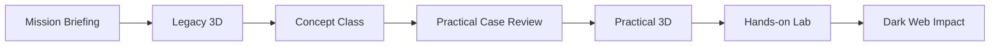

# Orion Echo Hands-on Lab

ROOT14 `Orion Echo Enterprise APT Range`의 실습 단계용 Docker lab 패키지입니다.

이 디렉토리는 기존 `root14_senario2-main` lab을 교육 플랫폼 흐름에 맞게 다시 정리한 버전입니다. 원본 lab의 실행 코드는 보존하되, 문서와 학습 흐름은 현재 커리큘럼 기준으로 재구성했습니다.

## 커리큘럼 내 위치



이 lab은 `Hands-on Lab` 단계입니다.

학습자는 앞 단계에서 이미 다음을 학습했다고 가정합니다.

- 공급망 공격이 무엇인지
- DMZ, Corporate, DevOps, Release, Customer 망 경계가 어떻게 나뉘는지
- Token, CI/CD, Signing, Update Channel, Evidence가 어떤 의미인지
- Practical 3D에서 각 단계가 어떤 시스템과 연결되는지

## 실행

PowerShell에서 이 디렉토리로 이동한 뒤 실행합니다.

```powershell
docker compose up --build -d
.\scripts\walkthrough.ps1
```

브라우저 진입점:

```text
http://localhost:28081
```

컨테이너 내부 end-to-end 검증:

```powershell
docker compose exec -T support-portal sh -c "cat > /tmp/verify_chain.py" < scripts/verify_chain.py
docker compose exec -T support-portal python /tmp/verify_chain.py
```

## 핵심 흐름

```text
Recon
-> Support Portal Initial Access
-> Foothold Orientation
-> Safe C2 Emulator
-> Internal Discovery
-> Wiki / Ticket / Repo Evidence Collection
-> Build Token Use
-> Artifact Build
-> Signing and ANRC Channel Publish
-> Customer Trusted Update
-> Customer Export Discovery
-> Final Object Collection
-> Dark Web Leak Bundle
```

## 문서

- `docs/01-curriculum-flow.md`: 커리큘럼 관점의 전체 흐름
- `docs/02-student-lab-guide-ko.md`: 학습자용 실습 가이드
- `docs/03-instructor-guide-ko.md`: 강사용 운영/해설 가이드
- `docs/04-practical-3d-mapping.md`: Practical 3D와 Hands-on Lab 단계 매핑
- `docs/platform/lab-stage-manifest.json`: 플랫폼 연동용 단계 manifest 초안
- `docs/platform/platform-integration.md`: ROOT14 플랫폼 연결 설계

## 안전 경계

이 lab은 교육용 폐쇄 Docker 환경입니다.

- 실제 악성코드 없음
- 외부 C2 없음
- Docker host escape 없음
- `docker.sock` mount 없음
- privileged container 없음
- 임의 shell passthrough 없음
- 위험 행위는 marker, scoped token, safe C2 emulator로 모델링
- 내부 채점 토큰은 기본 비활성화. 강사/플랫폼 검증이 필요할 때만 `INSTRUCTOR_GRADING_KEY`를 런타임 환경변수로 주입


