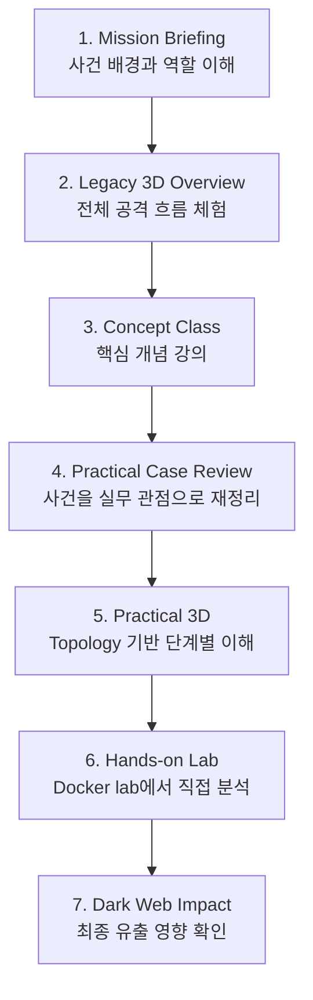
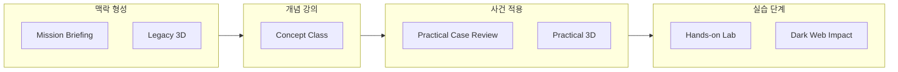

# 01. Curriculum Flow

## 목적

이 문서는 Orion Echo Hands-on Lab이 ROOT14 학습 흐름에서 어떤 위치를 가지는지 정의합니다.

핵심 원칙:

> Hands-on Lab은 개념강의가 아니라, 개념강의와 Practical 3D를 마친 학습자가 직접 분석을 수행하는 실습 단계다.

## 전체 교육 흐름

## 교육 단계 그룹

## Hands-on Lab이 맡는 역할

Hands-on Lab은 다음 질문에 답하게 만드는 단계입니다.

1. 공개 표면에서 어떤 정보를 먼저 확인해야 하는가?
2. 초기 접근 이후 바로 공격을 확장하지 않고 무엇을 확인해야 하는가?
3. 내부망에는 어떤 서비스와 증거 지점이 있는가?
4. 빌드 권한 단서는 어디에 있고, decoy와 어떻게 구분하는가?
5. 빌드, 서명, 업데이트 배포가 어떻게 고객 환경으로 이어지는가?
6. 고객 환경에서 어떤 export가 최종 목표인지 어떻게 판단하는가?
7. 고객 export 파일을 직접 회수했고 supervisor bot이 올바른 파일로 검증했음을 어떻게 확인하는가?

## Lab 단계 요약

| Lab 단계 | 목적 | 주요 시스템 |
| --- | --- | --- |
| 0. Recon | 공개 정보와 제품/고객/업데이트 단서 확인 | edge-proxy, public-site, public-docs |
| 1. Initial Access | support portal의 Jinja2 draft preview SSTI를 확인하고 foothold marker 획득 | support-portal |
| 2. Foothold Orientation | 현재 권한, host, 제한된 파일 구조 확인 | support-portal |
| 3. Safe C2 | 실제 C2 대신 safe emulator로 작전 채널 개념 확인 | c2-emulator |
| 4. Internal Discovery | 내부 서비스 목록과 네트워크 경계를 확인 | c2-emulator, corp services |
| 5. Evidence Collection | wiki, ticket, repo에서 빌드 단서와 decoy 구분 | wiki, ticket-service, source-repo |
| 6. Build Token Use | valid token으로 build job 실행 | build-server |
| 7. Artifact Build | benign artifact와 marker 생성 확인 | build-server |
| 8. Sign & Publish | manifest 서명 후 ANRC update channel publish | signing-service, update-server |
| 9. Customer Update | 고객 앱이 trusted update를 적용하는 과정 확인 | customer-app, customer-api |
| 10. Customer Collection | customer export와 final object 확인 | customer-api, object-store |
| 11. Dark Web Impact | customer export file을 supervised drop validation과 dark-web drop record로 연결 | dark-web-drop |

## Dark Web Impact의 위치

`Dark Web Impact`는 정본 Orion Echo 시나리오의 최종 단계입니다.

최종 확인에는 최소 다음 항목이 연결되어야 합니다.

- customer export id
- object key
- presigned URL 또는 object access proof
- supervisor drop verdict
- dark-web drop record
- exposed customer dataset
