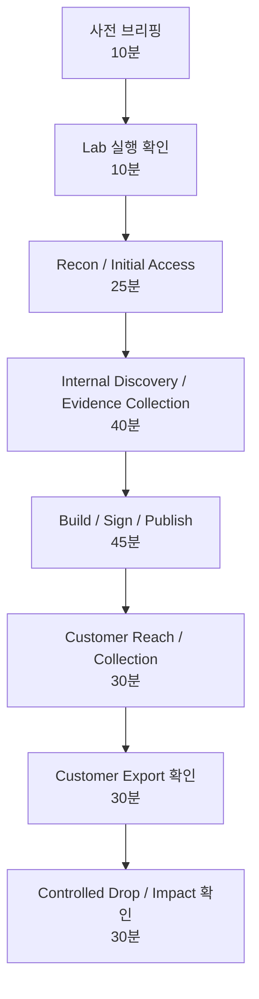

# 03. Instructor Guide

## 수업 운영 목표

이 lab은 `공급망 공격 전체 체인`을 실제 침투 절차처럼 따라가며 이해하도록 설계되어 있습니다.

강사는 학생에게 단순한 정답 문자열을 찾게 하기보다, 각 단계마다 다음 질문을 던지게 해야 합니다.

- 이 단계는 어느 네트워크 영역에서 일어나는가?
- 공격자는 어떤 신뢰 관계를 이용하는가?
- 방어자는 어떤 로그와 증거를 봐야 하는가?
- 이 증거만으로 충분한가, 아니면 다른 시스템의 로그와 연결해야 하는가?

## 권장 수업 흐름



## 단계별 강의 포인트

| 단계 | 강사가 강조할 점 |
| --- | --- |
| Recon | 공개 정보가 공격 체인의 일부가 될 수 있음을 보여줍니다. 제품명, 고객명, version, channel을 기록하게 합니다. |
| Initial Access | 취약점 자체보다 취약점 이후 어느 경계로 이동할 수 있는지가 중요합니다. |
| Foothold | 현재 권한과 host context 확인 없이 이동하면 분석이 흐려집니다. |
| Safe C2 | 실제 악성 C2가 아니라 post-exploitation lifecycle을 안전하게 모델링합니다. |
| Internal Discovery | 서비스 이름과 네트워크 영역을 지도처럼 정리하게 합니다. |
| Evidence Collection | valid, partial, decoy, noise를 구분하게 합니다. |
| Build Token | token은 password가 아니어도 권한을 전달하는 인증 재료가 될 수 있습니다. |
| Artifact Build | source repo와 artifact는 다른 증거입니다. build output을 반드시 확인하게 합니다. |
| Sign & Publish | signing은 안전 보증이 아니라 신뢰 신호입니다. 입력이 오염되면 서명도 오염됩니다. |
| Customer Update | 고객은 vendor update channel을 신뢰합니다. 이것이 공급망 공격의 핵심입니다. |
| Final Object | 고객 데이터 접근은 직접 침입이 아니라 trust chain의 결과로 발생합니다. |
| Controlled Drop | 회수한 파일을 감독 봇이 검증하게 하여 최종 영향과 증거 무결성을 확인합니다. |

## 평가 기준

학습자는 최종 impact 확인에서 다음을 설명할 수 있어야 합니다.

1. 고객 직접 침입과 공급망 공격의 차이
2. Orion Echo에서 사용된 주요 네트워크 경계
3. build token이 위험한 이유
4. signing된 artifact가 항상 안전하지 않은 이유
5. ANRC customer update가 공격 경로가 된 이유
6. customer export와 object-store 접근이 연결되는 방식
7. supervisor verdict와 dark_web_drop_record까지 이어지는 증거 흐름

## 주요 Audit Event

| 이벤트 | MITRE | 의미 |
| --- | --- | --- |
| `recon.route.viewed` | T1591 / T1592.002 | 공개 정보 정찰 |
| `support.exploit.preview_triggered` | T1190 | 공개 서비스 초기 접근 |
| `support.post_exploit.command_allowed` | T1059.004 | 제한된 foothold 명령 |
| `c2.beacon.registered` | T1071.001 | safe C2 등록 |
| `c2.discovery.service_probe` | T1046 | 내부 서비스 탐색 |
| `wiki.page.viewed` | T1213 / T1552 | 내부 문서 단서 확인 |
| `repo.file.viewed` | T1213.003 | source repo 단서 확인 |
| `api.token.accepted` | T1550.001 | build token 사용 |
| `build.artifact.created` | T1608 | artifact 생성 |
| `release.manifest.published` | T1195.002 | ANRC channel publish |
| `customer.update.applied` | T1072 | trusted update 적용 |
| `object.final.downloaded` | T1530 | final object collection |
| `darkweb.supervisor.passed` | T1041 | supervisor bot이 dropped export file 검증 통과 |

## 강사용 빠른 검증

```powershell
docker compose up --build -d
.\scripts\walkthrough.ps1
```

또는:

```powershell
docker compose exec -T support-portal sh -c "cat > /tmp/verify_chain.py" < scripts/verify_chain.py
docker compose exec -T support-portal python /tmp/verify_chain.py
```

정상 종료 기준:

- object-store에서 `object_access_proof`가 포함된 ANRC final export를 회수합니다.
- `dark-web-drop /drop/submit`에서 supervisor bot `status: passed`를 확인합니다.
- verdict에는 `submission_id`, `received_file`, `checks`, `exposed_dataset`, `dark_web_drop_record`가 포함됩니다.
- `customer.update.applied` 이후 `customer-api /metadata`에서 `update_event_proof`가 확인됩니다.

## 주의 사항

- 학생에게 모든 명령을 처음부터 제공하면 CTF 풀이가 됩니다. 수업 목적에 따라 일부 단계는 질문형으로 숨기는 것이 좋습니다.
- `demo/sign-and-publish`는 교육 진행을 쉽게 하기 위한 helper endpoint입니다. 심화 수업에서는 canonical manifest 생성, signing 요청, publish 요청을 분리해 진행할 수 있습니다.
- 현재 lab은 1인용 demo scope입니다. 다중 사용자 세션, per-session grading token, ROOT14 자체 제출 UI는 별도 플랫폼 단계에서 구현해야 합니다.
- 운영 메모: 기본 학습자 runbook은 canonical manifest 생성, signing 요청, publish 요청을 분리해서 진행합니다. `demo/sign-and-publish`는 강사용 빠른 walkthrough 또는 장애 대응용 helper로만 취급합니다.
- 운영 메모: 실제 플랫폼 연동 시 `INSTRUCTOR_GRADING_KEY`는 안전한 채널로 런타임에만 주입합니다. lab 소스나 학습자 패키지에는 고정 키를 포함하지 않습니다.
