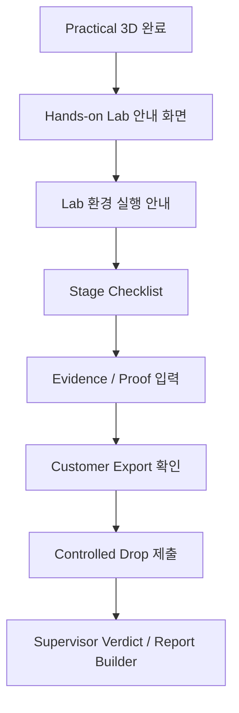

# Platform Integration

## 목적

이 문서는 Orion Echo Hands-on Lab을 ROOT14 플랫폼의 `Hands-on Lab` 세션에 연결하기 위한 설계 초안입니다.

핵심 방향은 CTF식 정답 문자열 제출이 아니라, 실제 침투 보고서처럼 단계별 증거를 모으고 최종 회수 파일을 supervisor bot이 검증하는 구조입니다.

## 플랫폼에서 보여줄 흐름

## 필요한 화면

| 화면 | 역할 |
| --- | --- |
| Lab Intro | 실습 목표, 최종 목표 파일, 안전 경계, 실행 방법 안내 |
| Stage Checklist | stage별 진행 상태와 힌트 표시 |
| Evidence Panel | 각 단계에서 제출해야 할 proof, 로그, 관찰 내용 입력 |
| MITRE Mapping | audit event와 MITRE technique 연결 |
| Controlled Drop Panel | 회수 파일 제출, supervisor verdict, exposed dataset 확인 |
| Report Builder | pentest-style 증거 요약과 remediation note 생성 |

## Stage 데이터 출처

플랫폼은 `docs/platform/lab-stage-manifest.json`을 읽어 다음을 구성할 수 있습니다.

- stage id
- stage title
- phase
- objective
- required systems
- evidence to collect
- MITRE mapping
- expected output
- internal grading id 또는 복수 grading ids

## 현재 미구현 항목

이 lab은 아직 로컬 Docker demo입니다. 플랫폼에 완전히 붙이려면 다음이 필요합니다.

1. 사용자별 lab session 생성
2. session별 내부 grading token 발급
3. stage completion API
4. ROOT14 제출 UI
5. audit-log 조회 UI
6. Controlled Drop evidence 저장
7. lab start/stop lifecycle 관리

## 권장 통합 순서

1. 이 lab을 내부 Docker lab으로 유지하고, 플랫폼에서는 실행 가이드와 stage checklist만 먼저 연결합니다.
2. static manifest를 ROOT14 화면에 표시합니다.
3. audit-log를 읽는 API bridge를 추가합니다.
4. evidence/proof submission과 report builder를 추가합니다.
5. session orchestration으로 확장합니다.
## Instructor-only Grading Key

`grading-service`는 `INSTRUCTOR_GRADING_KEY`가 런타임에 주입된 경우에만 `/internal/grading/{stage_id}`를 활성화합니다.
학습자에게 배포되는 lab source, zip, Git repository에는 고정 instructor key를 포함하지 않습니다.
플랫폼이 여러 grading proof를 요구하는 stage는 `internalGradingIds`를 우선 읽고, legacy consumer만 `internalGradingId`를 fallback으로 사용합니다.
