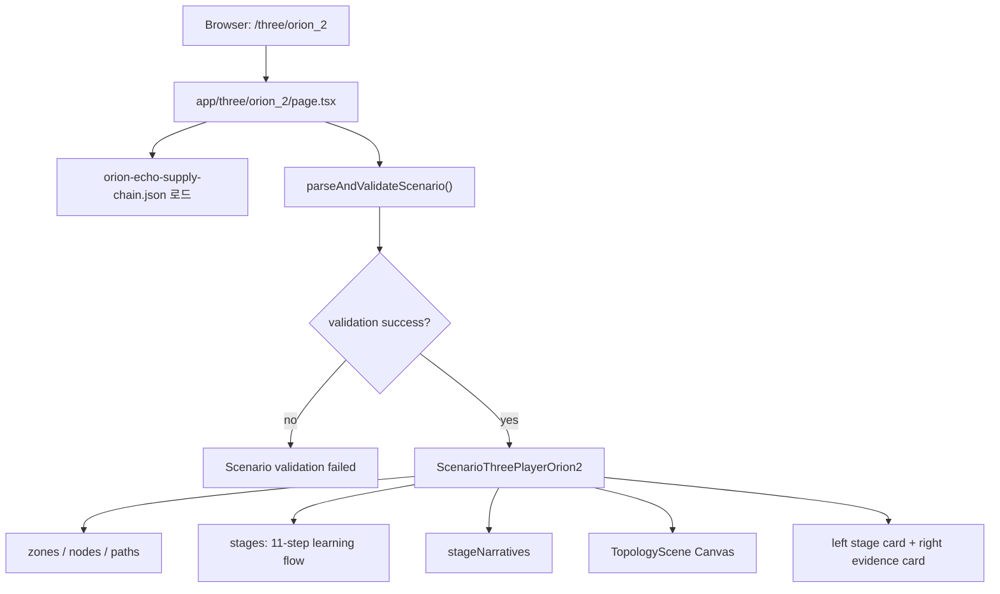
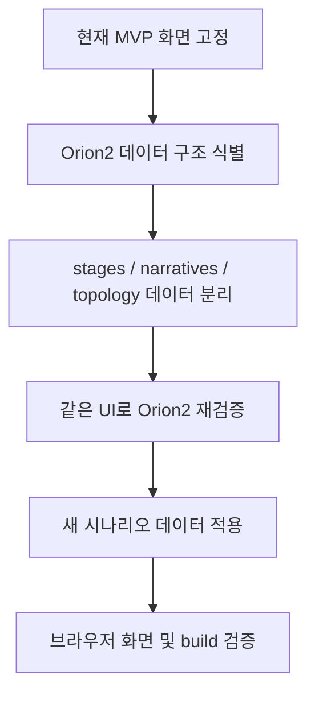

# Orion Echo V2 MVP Documentation

이 문서는 `senario/09_platform/mvp` 폴더의 최종 MVP 기준을 고정하기 위한 작업 문서다.

현재 기준 화면은 다음 URL이다.

```text
http://localhost:3100/three/orion_2
```

## 현재 합의된 기준

`/three/orion_2`는 Orion Echo V2의 최종 Practical 3D MVP 화면이다.

이 화면은 이전 버전의 generic 3D player 또는 legacy 3D 세션과 섞으면 안 된다. 앞으로 콘텐츠 수정, 템플릿화, 시나리오 확장은 이 MVP 화면을 기준으로 진행한다.

브라우저에서 보여야 하는 기준 UI는 다음과 같다.

- 좌측 카드 상단: `NETWORK TOPOLOGY VIEW`
- 제목: `Orion Echo V2 Red Team Testbed`
- 진행 표시: `Step 1 / 11`
- 첫 단계: `Stage 0. 공개 표면 정찰`
- 우측 카드: 현재 stage의 tactic, evidence, note 설명
- 첫 stage 우측 제목: `Reconnaissance`

## 용어 정리

| 이름 | 의미 | 현재 수정 대상 여부 |
| --- | --- | --- |
| Legacy 3D | 기존 별도 3D 세션. 우측 레이아웃과 예시 shell이 나오던 흐름 | 현재 MVP 수정 대상 아님 |
| Practical 3D MVP | `mvp` 폴더의 `/three/orion_2` 화면 | 현재 최종 수정 대상 |
| Generic 3D Player | `/three/[scenarioId]`에서 쓰는 범용 player | Orion2 최종 화면에 섞지 않음 |
| Orion2 Final Player | `ScenarioThreePlayerOrion2.tsx` | 현재 기준 컴포넌트 |

## 실행 방법

MVP 폴더에서 실행한다.

```bash
npm run dev
```

기본 포트는 `3100`이다.

```text
http://localhost:3100/three/orion_2
```

빌드 검증은 다음 명령으로 한다.

```bash
npm run build
```

## 파일 구조

현재 Orion2 MVP와 직접 관련된 파일은 다음과 같다.

```text
mvp/
  app/
    three/
      orion_2/
        page.tsx
  components/
    ScenarioThreePlayerOrion2.tsx
    ScenarioThreePlayer.tsx
  data/
    orion-echo-supply-chain.json
  lib/
    scenario/
      schema.ts
```

핵심 기준:

- `app/three/orion_2/page.tsx`는 반드시 `ScenarioThreePlayerOrion2`를 렌더링한다.
- `components/ScenarioThreePlayerOrion2.tsx`가 최종 Practical 3D MVP 화면이다.
- `components/ScenarioThreePlayer.tsx`는 generic player이며, Orion2 최종 화면의 기준이 아니다.
- `data/orion-echo-supply-chain.json`은 schema 검증에는 사용되지만, 현재 Orion2 화면의 3D stage 구성은 주로 `ScenarioThreePlayerOrion2.tsx` 내부 상수에 들어 있다.

## 현재 렌더링 흐름



## ScenarioThreePlayerOrion2 내부 구성

`components/ScenarioThreePlayerOrion2.tsx` 안의 주요 구성은 다음과 같다.

| 구성 | 역할 |
| --- | --- |
| `zones` | 3D 네트워크 구역 정의 |
| `nodes` | 3D 장비/시스템 노드 정의 |
| `paths` | 신뢰 경로 및 공격 흐름 경로 정의 |
| `stages` | 11단계 학습 흐름 정의 |
| `stageNarratives` | 각 단계의 우측 설명 카드 내용 |
| `TopologyScene` | Canvas 위에 3D topology를 그리는 장면 |
| `ScenarioThreePlayerOrion2` | 전체 UI, stage 이동, 좌우 카드 렌더링 |

## 현재 11단계 흐름

현재 화면은 `Step 1 / 11`부터 시작한다. 단계 데이터는 `ScenarioThreePlayerOrion2.tsx`의 `stages` 배열이 기준이다.

```mermaid
flowchart LR
  S0["0. 공개 표면 정찰"] --> S1["1. 공급망 단서 수집"]
  S1 --> S2["2. 최초 침투"]
  S2 --> S3["3. 내부 발견"]
  S3 --> S4["4. 권한 및 토큰 확보"]
  S4 --> S5["5. 빌드/릴리즈 경로 접근"]
  S5 --> S6["6. 배포 신뢰 관계 악용"]
  S6 --> S7["7. 고객 환경 영향"]
  S7 --> S8["8. 탐지 및 증거"]
  S8 --> S9["9. 대응 판단"]
  S9 --> S10["10. 복구 및 재발 방지"]
```



단계 이름은 코드 안의 실제 값이 우선이다. 위 다이어그램은 문서용 요약이며, 콘텐츠 수정 시 반드시 `stages`와 `stageNarratives`를 함께 확인해야 한다.

## 수정 원칙

Orion2 MVP를 수정할 때는 다음 원칙을 따른다.

1. `/three/orion_2`는 계속 `ScenarioThreePlayerOrion2`를 사용한다.
2. 이전 generic player인 `ScenarioThreePlayer`를 Orion2 기준 화면에 연결하지 않는다.
3. stage 수를 바꾸면 `stages`와 `stageNarratives`의 개수를 함께 맞춘다.
4. 3D topology를 바꾸면 `zones`, `nodes`, `paths`, `TopologyScene`의 참조 관계를 함께 확인한다.
5. 텍스트만 바꾸는 수정이어도 브라우저에서 실제 화면을 확인한다.
6. 최종 확인은 `npm run build`와 브라우저 확인을 함께 수행한다.

## 템플릿화 방향

앞으로 다른 시나리오를 쉽게 적용하려면 기존 generic player를 가져오는 방식이 아니라, `ScenarioThreePlayerOrion2`의 최종 화면 구조를 기준으로 데이터만 분리해야 한다.

권장 방향:

```text
ScenarioThreePlayerOrion2.tsx
  UI / interaction / 3D rendering 담당

data 또는 lib/scenario/
  zones
  nodes
  paths
  stages
  stageNarratives
  scenario metadata
```

목표는 다음과 같다.

- 새로운 시나리오를 추가해도 같은 UI와 3D 진행 경험을 유지한다.
- 인프라 구성, 공격 흐름, stage 설명을 데이터로 교체할 수 있게 한다.
- 기존 MVP 화면의 디자인과 interaction은 유지한다.
- 이전 버전의 generic player와 섞이지 않게 한다.

## 현재 주의할 점

현재 `ScenarioThreePlayerOrion2.tsx`는 최종 화면을 빠르게 구현한 MVP 형태라서, 데이터와 UI가 한 파일에 많이 들어 있다. 따라서 콘텐츠 수정은 가능하지만, 큰 시나리오 교체를 반복하려면 먼저 데이터 분리가 필요하다.

즉, 지금 단계에서 가장 안전한 작업 순서는 다음과 같다.



## 검증 체크리스트

수정 후 다음 항목을 확인한다.

- `/three/orion_2` 접속 가능
- 첫 화면에 `NETWORK TOPOLOGY VIEW` 표시
- 제목이 `Orion Echo V2 Red Team Testbed`
- 진행 표시가 `Step 1 / 11`
- `Previous`, `Reset`, `Next` 버튼 표시
- `Next` 클릭 시 stage가 정상적으로 전환
- 브라우저 console error 없음
- `npm run build` 성공

