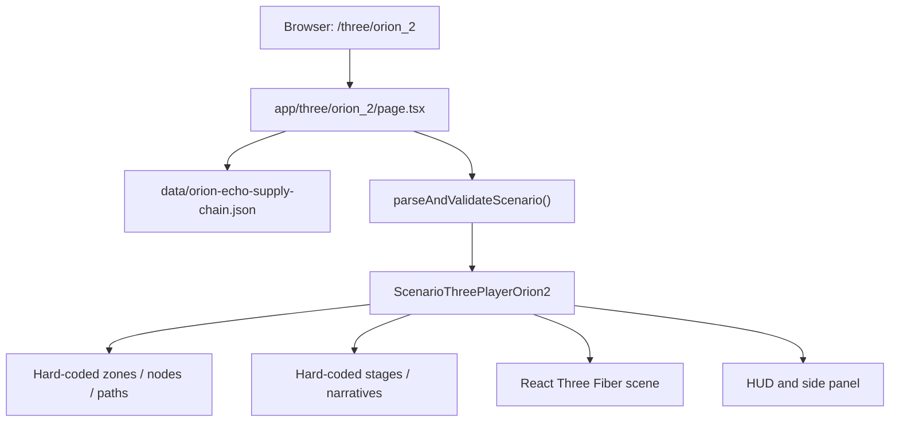
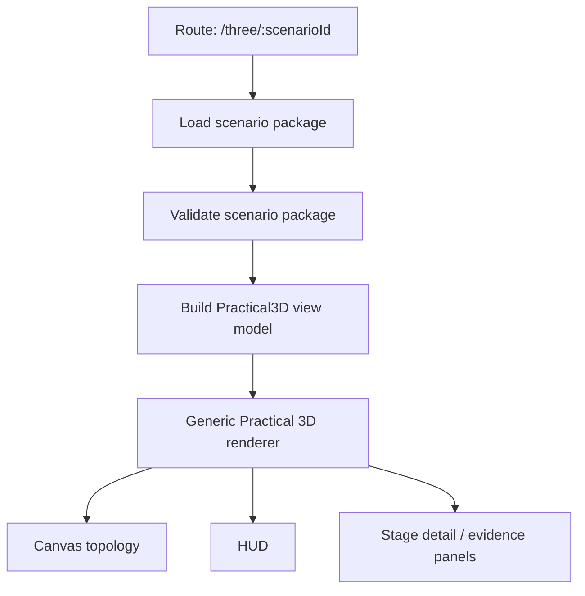

# Practical 3D Template Direction

This document defines the naming and template direction for the Practical 3D experience that currently lives at:

```text
http://localhost:3100/three/orion_2
```

## Naming Rule

`Orion Echo` is a scenario name.

`orion2` is not a reusable renderer or template name. It is a legacy/working route name that came from the current Orion Echo scenario work. Future reusable code should not use `orion2` as the generic concept.

Use these naming boundaries:

| Layer | Preferred naming | Example |
| --- | --- | --- |
| Renderer / template | generic practical 3D name | `EnterprisePractical3DPlayer`, `ScenarioPractical3DPlayer` |
| Scenario content | scenario-specific name | `orionEchoScenario`, `orion-echo.view-model.ts` |
| Route | scenario id | `/three/orion-echo` |
| Legacy route | compatibility only | `/three/orion_2` |

## Current State

The current page is wired like this:



The JSON scenario is validated, but most of the visible 3D topology and stage behavior is still hard-coded inside `components/ScenarioThreePlayerOrion2.tsx`.

## Target State

The target is to keep the current visual experience but make the scenario swappable.



The renderer should know how to draw a practical 3D experience. It should not know that the scenario is Orion Echo.

## Scenario Package Shape

Future scenarios should be represented with a view model shaped like this:

```ts
type Practical3DScenario = {
  metadata: {
    id: string
    title: string
    subtitle?: string
    difficulty?: string
    estimatedMinutes?: number
  }
  theme: {
    title?: string
    colors?: Record<string, string>
  }
  topology: {
    zones: TopologyZone[]
    nodes: TopologyNode[]
    paths: TrustPath[]
    detailZone?: {
      center: Vec3
      size: [number, number]
    }
  }
  stages: Practical3DStage[]
}
```

Each stage should contain both the topology activation data and the learner-facing narrative:

```ts
type Practical3DStage = {
  id: string
  title: string
  tactic: string
  summary: string
  evidenceNote: string
  activeNodes: string[]
  activePaths: string[]
  components: StageComponent[]
}
```

## Refactor Plan

1. Preserve the current `/three/orion_2` behavior.
2. Rename generic code away from `orion2`.
3. Move hard-coded Orion Echo data out of the renderer.
4. Introduce a scenario view model file for Orion Echo.
5. Point the renderer at the view model and verify the page still looks the same.
6. Add a generic route such as `/three/orion-echo`.
7. Keep `/three/orion_2` as a compatibility alias until the main site no longer links to it.

## Suggested File Direction

```text
mvp/
  app/
    three/
      orion_2/
        page.tsx                  # legacy alias
      [scenarioId]/
        page.tsx                  # future reusable route
  components/
    EnterprisePractical3DPlayer.tsx
  data/
    practical-3d/
      orion-echo.ts
  lib/
    scenario/
      practical3d.ts              # shared types + validation helpers
```

## First Safe Refactor

The first implementation step should be small:

- Create a view model file for the current Orion Echo data.
- Move only `zones`, `nodes`, `paths`, `stages`, `stageNarratives`, and `detailZone` into that file.
- Keep the visual renderer nearly unchanged.
- Rename only after the extracted data renders correctly.

This keeps the current MVP usable while opening the door for additional scenarios.

## Verification Checklist

After each refactor step:

- `/three/orion_2` returns `200`.
- The first screen still shows `Network Topology View`.
- The title still shows the Orion Echo scenario title.
- Stage navigation still advances from Step 1 to Step 11.
- Active nodes, active paths, and stage detail objects still update.
- `npm run build` succeeds from `senario/09_platform/mvp`.
